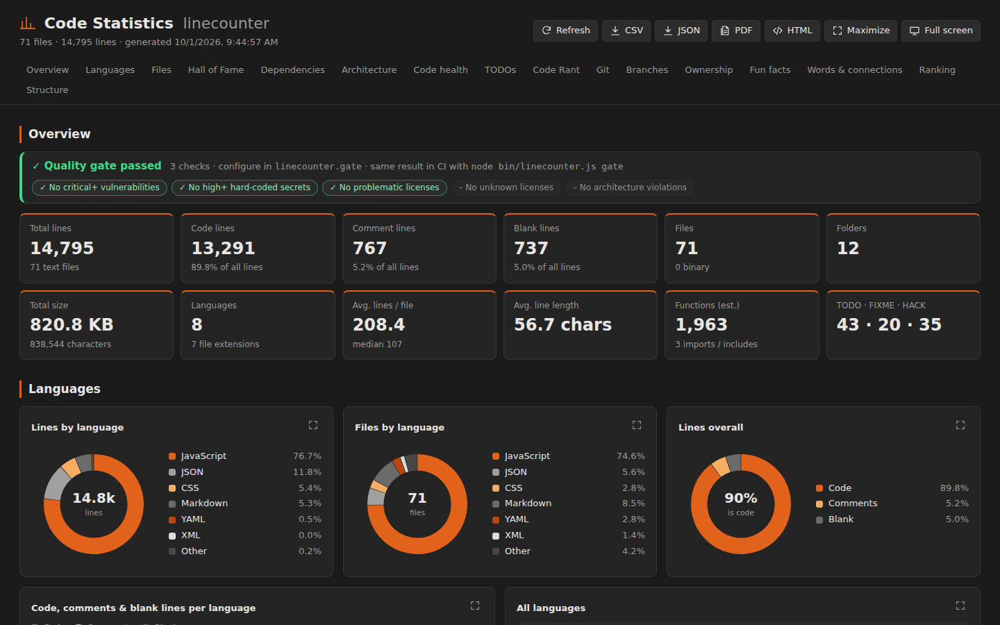
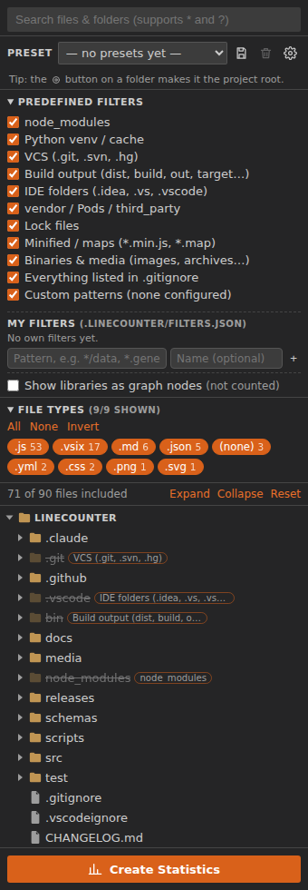
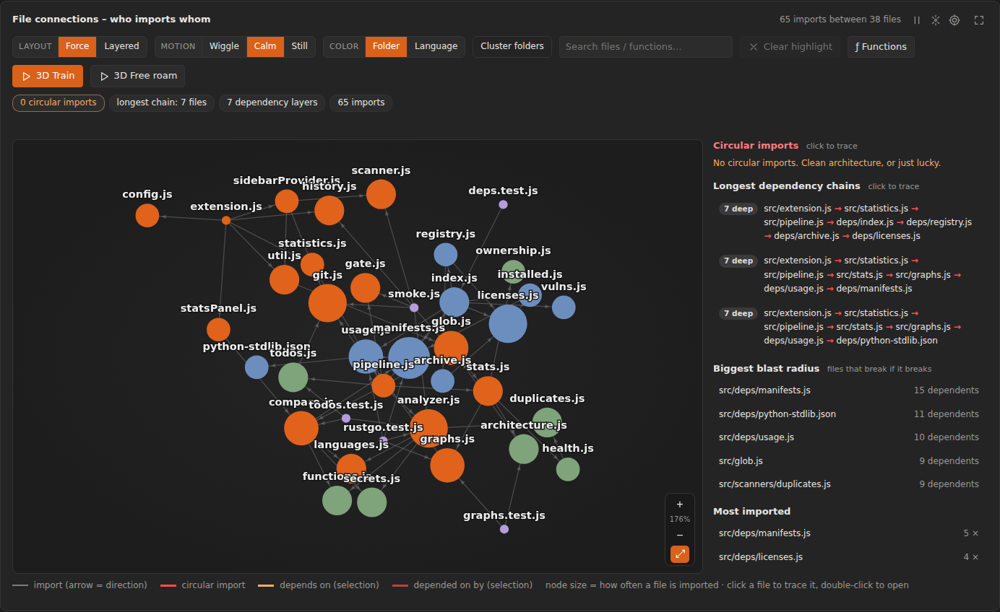
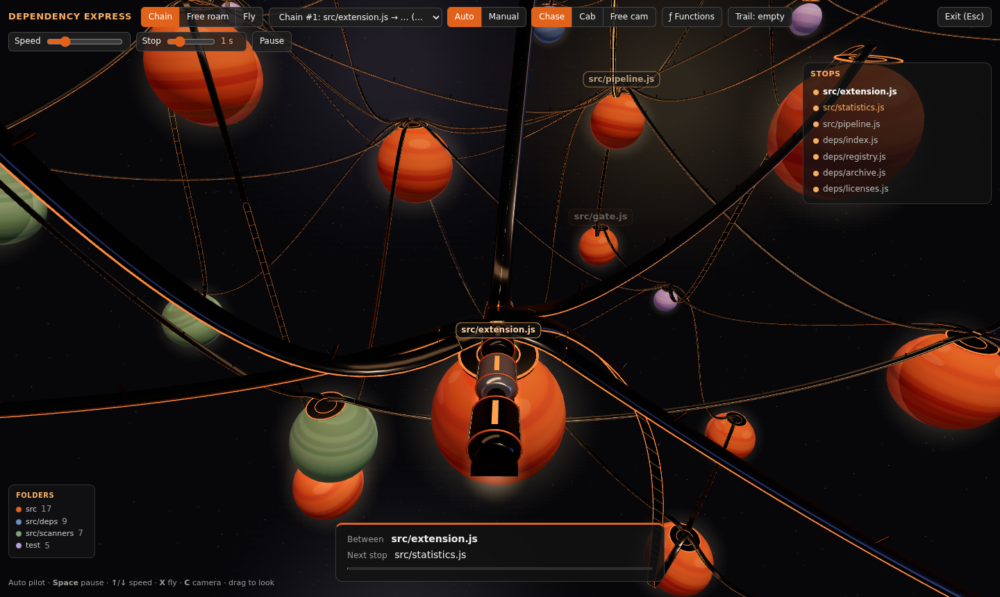
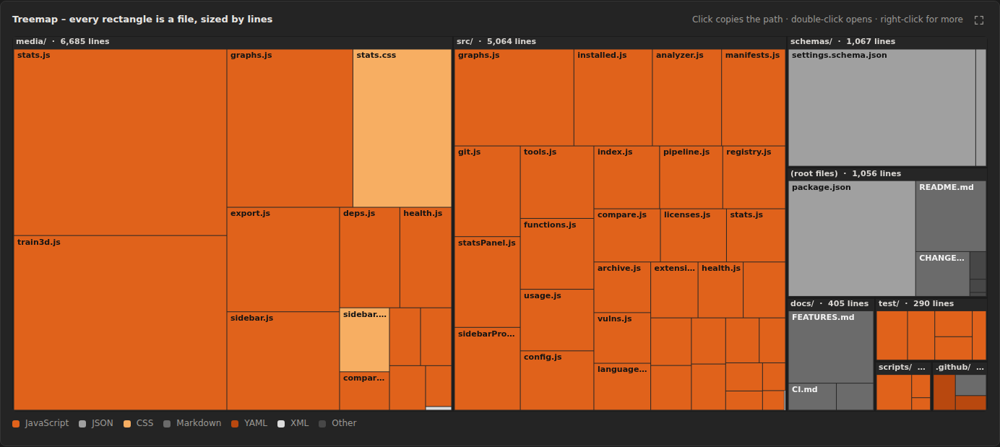
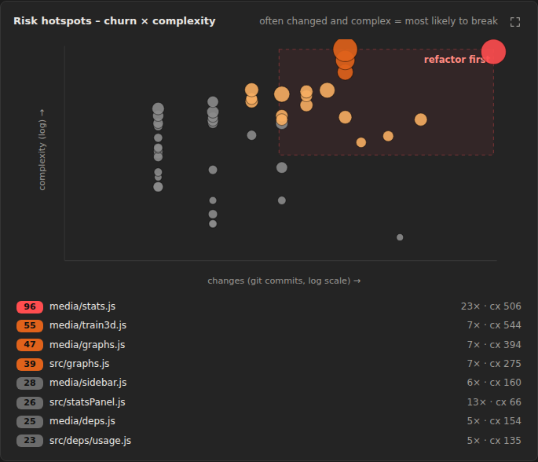
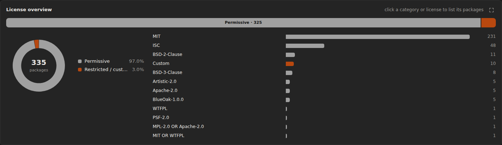
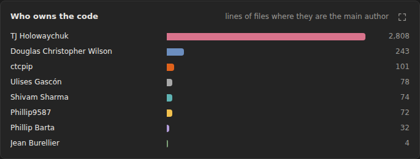
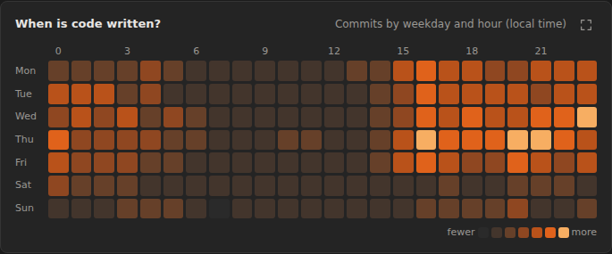
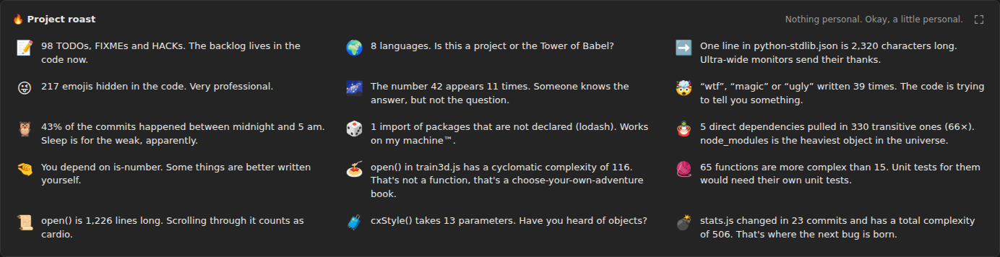

<p align="center"></p>

# Line Counter & Code Statistics

[](https://github.com/EinsPhoenix/linecounter/releases/latest)
[](https://github.com/EinsPhoenix/linecounter/releases/latest/download/linecounter.vsix)
[](https://github.com/EinsPhoenix/linecounter/actions/workflows/ci.yml)
[](CHANGELOG.md)
[](LICENSE)
[](#installation)

**⬇️ [Neueste Version herunterladen (`linecounter.vsix`)](https://github.com/EinsPhoenix/linecounter/releases/latest/download/linecounter.vsix)** · [Alle Releases](https://github.com/EinsPhoenix/linecounter/releases) · [Changelog](CHANGELOG.md)

VS-Code-Extension, die alle Dateien und Ordner des Workspaces rekursiv als Baum in der Sidebar anzeigt. Dort filterst du die Auswahl und erzeugst mit einem Klick eine Statistik-Seite im Vollbild.



**Ausführliche Beschreibung aller Funktionen, was du erwarten kannst und wo die Grenzen liegen: [`docs/FEATURES.md`](docs/FEATURES.md)**

## Auf einen Blick

| Bereich | Was du bekommst | Mehr |
|---|---|---|
| Statistik | Zeilen, Sprachen, Treemap, Hall of Fame, Rants, Fun Facts, Rangliste | [FEATURES](docs/FEATURES.md#statistik-seite) |
| Trends | Kennzahlen jedes Laufs als Verlauf, Änderungen seit dem letzten Lauf | [FEATURES](docs/FEATURES.md#trends) |
| Code health | Komplexität pro Funktion, Risiko-Hotspots (Churn × Komplexität), ungenutzte Funktionen, Duplikate, Secrets | [FEATURES](docs/FEATURES.md#code-health) |
| Dependencies | Lizenzen aller Pakete (npm, PyPI, crates.io, Go), Schwachstellen (OSV), ungenutzte und nicht deklarierte Pakete | [FEATURES](docs/FEATURES.md#dependencies-lizenzen-und-schwachstellen) |
| Architecture | Regeln wie „`ui/` darf nicht `db/` importieren“ und Schichten; Verstöße rot im Graphen | [FEATURES](docs/FEATURES.md#architecture) |
| Git | mehrere Repos mit Übersicht, Ownership und Bus-Factor, verwaiste Dateien, TODO-Tracker mit Alter, Branch-Vergleich | [FEATURES](docs/FEATURES.md#branch-comparison) |
| Graphen | Importgraph mit Zyklen, Ketten, Funktionen, Ordner-Clustern und Suche; bis 20.000 Knoten; 3D-Zug durch das Projekt | [FEATURES](docs/FEATURES.md#graphen-2d) |
| Quality Gate | gleiche Checks in VS Code und im CI (`node bin/linecounter.js gate`, Exit-Code 1) | [CI.md](docs/CI.md) |
| MCP-Server | 21 Tools für LLM-Agenten (Copilot, Claude Code …): Impact einer Änderung, Risiko, Schwachstellen, Lizenzen … | [MCP.md](docs/MCP.md) |
| Filter & Presets | eigene Filter wie `*/data`, Presets und Einstellungen in `.linecounter/`, Projekt-Root | [FEATURES](docs/FEATURES.md#sidebar-filter-und-presets) |

## Schnellstart

1. **Installieren:** [`linecounter.vsix` herunterladen](https://github.com/EinsPhoenix/linecounter/releases/latest/download/linecounter.vsix) und `code --install-extension linecounter.vsix` ausführen (oder *Extensions → … → Install from VSIX…*).
2. **Öffnen:** In der Activity Bar auf das Line-Counter-Symbol klicken. Die Sidebar zeigt den Dateibaum deines Workspaces.
3. **Filtern:** Ordner und Dateien per Klick ausschließen, Dateitypen ausblenden oder ein Preset laden.
4. **Auswerten:** **Create Statistics** klicken. Die Statistik-Seite öffnet sich im Vollbild. Über die Navigation oben springst du zu Sprachen, Dependencies, Code health, Git, Graphen …
5. **Teilen:** Oben rechts exportierst du CSV, JSON, HTML oder PDF. Einstellungen und Presets liegen in `.linecounter/` und können ins Repo.

## Screenshots

| | |
|---|---|
|  | **Sidebar:** Dateibaum mit Suche, vordefinierten und eigenen Filtern, Dateitypen, Presets und „Create Statistics“. |
|  | **Import-Graph:** wer importiert wen, nach Ordner gefärbt, mit Zyklen, längsten Ketten und „Blast Radius“. |
|  | **Dependency Express:** ein 3D-Zug fährt über die Importe durch dein Projekt, jeder Planet ist eine Datei. |
|  | **Treemap:** jedes Rechteck ist eine Datei, gruppiert nach Ordnern, Größe = Zeilen. |
|  | **Risiko-Hotspots:** Git-Churn × Komplexität zeigt, wo der nächste Bug entsteht. |
|  | **Lizenzen:** alle Pakete aus npm, PyPI, crates.io und Go nach Lizenz und Kategorie. |
|  | **Ownership:** wem der Code gehört, Bus-Factor und Wissen, das mit inaktiven Autoren verloren geht. |
|  | **Git:** wann Code geschrieben wird, Commits pro Monat, Hotspots und Fun Facts. |
|  | **Project roast:** die Statistik mit Humor. |

Mehr Bilder und alle Details: [`docs/FEATURES.md`](docs/FEATURES.md)

## Projekt-Root wählen

Ist in VS Code ein Sammelordner geöffnet (z. B. `D:\CodingThings\Graphoenix`) und liegen die eigentlichen Projekte in `Graphoenix\facgraph`, klickst du in der Sidebar auf einem Ordner auf das **Ziel-Symbol**. Dieser Ordner wird zum Projekt-Root: Die Statistik, alle Pfade, Ordnerfarben, Cluster und Planeten beziehen sich dann auf ihn. ↑ geht eine Ebene höher, ✕ setzt wieder auf den ganzen Workspace. Der Root wird im Workspace und in Presets gespeichert.

## Sprachunterstützung (Kurzfassung)

- **Zeilen zählen:** 74 Sprachen und Dateitypen
- **Importgraph:** JS/TS (inkl. `tsconfig`-Pfade und `@/`-Aliase), Python, Rust, Go, C/C++, CSS/SCSS/Less, HTML
- **Funktionen & Komplexität:** JS/TS, Python, Rust, Go, Java, Kotlin, Scala, C#, C/C++, Swift, PHP, Ruby, Lua, Dart
- **Pakete, Lizenzen, Schwachstellen:** npm, PyPI, crates.io (Rust), Go-Module

## Installation

1. Lade die neueste `linecounter.vsix` von der [Release-Seite](https://github.com/EinsPhoenix/linecounter/releases/latest) herunter (oder direkt: [linecounter.vsix](https://github.com/EinsPhoenix/linecounter/releases/latest/download/linecounter.vsix)).
2. Installiere sie:

```bash
code --install-extension linecounter.vsix
```

Alternativ in VS Code: *Extensions → „…“ → Install from VSIX…*

## Downloads

| Was | Wo |
|---|---|
| Neueste Version | [Releases → latest](https://github.com/EinsPhoenix/linecounter/releases/latest) |
| Ältere Versionen | [alle Releases](https://github.com/EinsPhoenix/linecounter/releases) (Tag `v<version>`, Release Notes aus dem Changelog) |
| Direkt im Repo | [`linecounter.vsix`](linecounter.vsix) (aktuell) und [`releases/`](releases/) |
| Für CI | `https://github.com/EinsPhoenix/linecounter/releases/latest/download/linecounter.vsix`, siehe [CI.md](docs/CI.md) |

Releases entstehen automatisch: Landet auf `main` eine neue Version (`package.json` + `releases/linecounter-<version>.vsix`), legt der Workflow [`release.yml`](.github/workflows/release.yml) Tag und Release mit der `.vsix` an.

## Sidebar („Line Counter“ in der Activity Bar)

- **Baum aller Dateien und Ordner** (rekursiv, Multi-Root-Workspaces werden unterstützt)
- **Klick auf eine Datei oder einen Ordner schließt ihn aus** (durchgestrichen). Ein erneuter Klick nimmt ihn wieder auf. Mit dem Pfeil klappst du Ordner auf und zu, das Pfeil-Symbol rechts öffnet die Datei.
- **Suchleiste**: filtert den Baum live. Wildcards (`*.test.js`, `?`) und Pfade (`src/utils`) funktionieren. Mit *Exclude all* oder *Include all* schließt du alle Treffer auf einmal aus oder wieder ein.
- **Vordefinierte Filter** (per Checkbox): `node_modules`, Python-venv/Caches (auch venvs mit anderem Namen, erkannt über `pyvenv.cfg`), `.git`, Build-Output (`dist`, `build`, `out`, `target`, …), IDE-Ordner, `vendor`, Lock-Files, minifizierte Dateien, Binärdateien/Medien und optional alles aus `.gitignore`.
  Ausgeschlossene Preset-Ordner werden nicht gescannt. Das hält große Workspaces schnell. Klickst du einen solchen Ordner an, wird er nachgeladen und eingeschlossen.
- **Dateitypen**: alle erkannten Endungen mit Anzahl als Chips. Ein Klick blendet einen Typ aus oder ein, dazu gibt es *All*, *None* und *Invert*.
- Die Auswahl wird pro Workspace gespeichert.
- **Filter-Presets:** Über die Preset-Leiste speicherst du die aktuelle Auswahl als benanntes Preset: ausgeschlossene Dateien und Ordner, ausgeblendete Dateitypen und aktive vordefinierte Filter. Du kannst Presets laden oder löschen. Sie liegen in `.linecounter/presets.json` im Workspace und lassen sich committen und im Team teilen. Das aktive Preset ist der Startzustand für neue Checkouts.
- **Eigene Ausschluss-Muster:** `linecounter.excludePatterns` nimmt Glob-Muster wie in `.gitignore` (`*.generated.ts`, `docs/`, `/build`, `src/**/*.spec.ts`). Sie erscheinen als Filter „Custom patterns“.
- **Create Statistics** startet die Auswertung.

## Statistik-Seite (öffnet maximiert oder im Vollbild)

Die Seite nutzt ein festes Farbschema aus dunklem Orange und Grau mit SVG-Icons. Nur die Hall of Fame und der Code Rant verwenden Emojis. **Jedes Diagramm** hat oben rechts einen Vollbild-Button, mit `Esc` geht es zurück.

- **Übersicht**: Zeilen gesamt, Code, Kommentare, Leerzeilen, Dateien, Ordner, Größe, Sprachen, Ø Zeilen/Datei, Median, Ø Zeilenlänge, geschätzte Funktionen, Imports, TODO/FIXME/HACK
- **Sprachen**: Donut-Charts (Zeilen, Dateien, Code/Kommentar/Leer), gestapelte Balken pro Sprache, Sprachtabelle
- **Dateien und Ordner**: Treemap **aller** Dateien (Canvas, nach Ordnern gruppiert, ohne Sammelblock „Other“, auch bei zehntausenden Dateien), größte Dateien nach Zeilen und Bytes, Top-Ordner, Dateiendungen, Verteilung der Dateilängen, letzte Änderung
  - **Treemap-Kachel:** Ein **Linksklick kopiert den Pfad** in die Zwischenablage, ein Doppelklick öffnet die Datei.
  - **Rechtsklick** (auch in Rangliste, Balken und Rant-Listen): Datei öffnen, Pfad bzw. relativen Pfad kopieren, im Dateimanager anzeigen oder **Datei löschen**. Beim Löschen kommt eine Sicherheitsabfrage, danach landet die Datei im Papierkorb oder wird endgültig gelöscht.
- **Hall of Fame**: 18 Kategorien mit Podest (🥇🥈🥉), darunter längste und schwerste Datei, längste Zeile (öffnet direkt an der Stelle), kleinste Datei, tiefste Verschachtelung, längster Name, TODO-Sammler, am besten dokumentiert, „Silent treatment“ (viel Code, kein Kommentar), Function Factory, Debug-Print-Champion, luftigste und dichteste Datei, breitester Code, Whitespace-Hoarder, Emoji-Artist, neueste Datei und Fossil. Die Hero-Karte 🏆 zeigt die meistdekorierte Datei.
- **Dependencies, licenses & vulnerabilities** (npm, Python, Rust, Go)
  - **Manifeste:** `package.json`, `requirements*.txt`, `pyproject.toml` (PEP 621, Poetry, uv, PDM), `Pipfile`, `setup.py`, `setup.cfg`, `Cargo.toml` (+ `Cargo.lock`), `go.mod` (+ `go.sum`)
  - **Lizenzen aller Pakete:** Ist eine Lizenz lokal unbekannt, wird nacheinander die Registry, das **Paket-Archiv** (LICENSE-Dateien darin), deps.dev und das GitHub-Repository geprüft. Was geprüft wurde, zeigt die Karte *Unknown & custom licenses* und das Lizenz-PDF.
  - **Installierte Pakete:** npm aus `package-lock.json` oder `node_modules`, Python aus der virtuellen Umgebung (`.venv`, `venv` oder jeder Ordner mit `pyvenv.cfg`) über `METADATA`, Classifier und Lizenzdateien. Ohne venv kommen die Versionen aus `Pipfile.lock`, `poetry.lock` oder `uv.lock`.
  - **Lizenz-Report:** jedes Paket (direkt und transitiv) mit normalisierter SPDX-Lizenz, Kategorie (permissive, weak/strong/network copyleft, restricted, unknown) und Status *problematic*, *review* oder *ok*. Filter und Export als CSV sind dabei. Welche Lizenzen problematisch sind, legst du in den Einstellungen fest.
  - **Vulnerability-Report** über [OSV.dev](https://osv.dev): Schweregrad (auch aus CVSS v3 berechnet), Advisory-Link, CVE, Zusammenfassung und korrigierte Version. Gesendet werden nur Paketname und Version, abschaltbar über `linecounter.vulnerabilities.enabled`.
  - **Unused & undeclared:** deklarierte Pakete, die nie importiert werden, und Imports von Paketen, die nicht deklariert sind. Heuristiken gibt es für CLI-Tools, Plugins, `@types`, Konfigurationsdateien, npm-Skripte und abweichende Python-Importnamen (`PyYAML` → `yaml`, `Pillow` → `PIL`, …).
 lästert über Dateien über der Zeilengrenze (Standard **500**) und über Dateien mit mehr als **10 %** Leerzeilen.
  - **Rant-o-Meter** (0–100) mit Stimmung von 😇 Zen bis 🌋 Volcanic
  - **Kennzahlen:** Zeilen über dem Limit, überflüssige Leerzeilen, schlimmster Übeltäter 👑
  - **Eskalationsstufen** zum Filtern: 🙄 Mild, 😤 Spicy, 🤬 Furious, 💀 Nuclear für zu lange Dateien und 🫧 Breezy, 🌬️ Drafty, 🏜️ Desert, 🕳️ Void für zu viele Leerzeilen
  - **🔥 Project roast:** Sprüche über Kommentarquote, Dateigröße, TODOs, Sprachen-Mix, Tabs vs. Spaces, Bus-Factor, Nachtschichten und mehr
  - **🎁 Bonus-Rants:** sehr lange Zeilen, Debug-Prints, TODO-Wunschlisten, Code ohne Kommentare, Trailing Whitespace, gegenseitige Imports, Import-Magneten
  - **💬 Commit message rant** (pro Repo): zu kurze und zu lange Messages, verbotene Begriffe (wip, asdf, tmp, final, please, …) mit Beispielen, immer gleiche Messages, SHOUTING, „!!“ und „??“, Reverts, Commits am Freitag nach 17 Uhr, Kleinschreibung, Punkt am Ende
  - Jeder Hall-of-Fame-Gewinner bekommt einen eigenen Roast.
  - Betroffene Werte sind in der Rangliste orange markiert.
- **Git** (Repos werden automatisch erkannt, auch verschachtelte): Commits, Contributors, erster und letzter Commit, Projektalter, +/− Zeilen, Branches und Tags, Commits pro Monat, Heatmap nach Wochentag × Uhrzeit, Top-Contributors, Hotspots (am häufigsten geänderte Dateien)
- **Git-Fun-Facts**: Nachteulen-Commits, Wochenend-Commits, längste Commit-Serie, busiest day, Bus-Factor, Fix-Quote, faule Commit-Messages, kürzeste und längste Message, größter Commit, Lieblingswörter
- **Fun Facts**: gedruckte Seiten und Stapelhöhe, Länge des Codes in einer Zeile (× Eiffelturm), Tippzeit, „× Harry Potter“, Kaffeeverbrauch, COCOMO-Aufwand und -Kosten, WTF/kLOC, Doku-Note, Tabs vs. Spaces, Debug-Prints, Semikolons, Trailing Whitespace, Vorkommen von 42, Emojis, Tweets, Disketten
- **Words & connections**
  - Word Cloud der meistgenutzten Bezeichner
  - **Word Web:** ein animierter, wackelnder Force-Graph aus den häufigsten Wörtern und den Dateien, die sie am meisten verwenden
  - **File connections:** ein Graph, wer wen importiert (JS/TS, Python, CSS/SCSS/Less, C/C++, HTML)
    - **Circular imports:** Zyklen beliebiger Länge werden erkannt (starke Zusammenhangskomponenten) und im Graphen **dauerhaft rot** gezeichnet. Die Seitenleiste listet jeden Zyklus mit Pfad (`a.ts → b.ts → c.ts → a.ts`). Ein Klick zeichnet ihn rot nach und zoomt hin.
    - **Dependency chains:** die längsten Importketten. Ein Klick hebt die Kette rot mit Pfad hervor, der Pfad lässt sich kopieren.
    - **Klick auf eine Datei:** alle Dateien, die (transitiv) davon abhängen, werden **rot**, alle Abhängigkeiten **bernsteinfarben**. Die Statuszeile nennt die Zahlen, auch für das ganze Projekt.
    - **Biggest blast radius:** die Dateien, von denen am meisten abhängt. Dazu Most imported und Imports the most, außerdem eine Dateisuche.
    - **Layout:** *Force* oder *Layered*. Layered zeigt Importeure oben und importierte Dateien darunter, Ketten laufen damit von oben nach unten.
    - **Bibliotheken als Knoten:** In der Sidebar gibt es unter den Filtern den Schalter *Show libraries as graph nodes*. Externe npm- und Python-Pakete werden dann zu Knoten im Graphen: Quadrate, und Pakete mit bekannten Schwachstellen als rote Totenköpfe. Tooltip mit Version, Lizenz und Schwachstellen. Sie zählen in keiner Statistik.
    - **3D Train (Dependency Express):**
      - **Welt:** Dateien sind Planeten (Größe nach Importen, roter Schein bei Zyklen), Bibliotheken sind Metallwürfel, verwundbare Pakete sind Totenköpfe, und Dateien, die verwundbare Pakete importieren, bekommen einen Totenkopf-Mond. Die Planeten stehen mit großem Abstand und überlappen nicht.
      - **Farben:** Planeten desselben Ordners haben dieselbe Farbe (Legende unten links), Funktionen die Farbe ihrer Datei.
      - **Gleise:** Jede Beziehung ist eine glänzende Magnetschwebe-Führungsschiene (Bézier-Kurve) mit Neon-Kanten, in denen Licht fließt. Sie läuft **über** die Planeten: Jede Beziehung verlässt den Planeten auf der oberen Hälfte in Richtung Ziel, und oben am Pol treffen sich alle Gleise auf einer **Drehscheibe**. Dort kreuzen sie sich, und dort wechselt der Zug die Beziehung. Zyklen haben rote Schienen, Funktionsaufrufe bernsteinfarbene.
      - **Zug:** eine Stromlinien-Magnetschwebebahn in Chrom und Klarlack mit Cockpit-Kuppel, Leuchtlinien, Finne, Winglets, Doppel-Triebwerk und Passagier-Pods mit Fensterbändern. Auf den Planeten richtet sich der Zug zur Oberfläche aus.
      - **Gefahrene Strecke:** Bereits gefahrene Beziehungen werden grün markiert. Je öfter du sie fährst, desto dicker wird die Linie. *Trail* in der Top-Bar zeigt die Anzahl und löscht die Spur.
      - **Funktionen (ƒ Functions):** Schaltest du im Graphen oder in der Zug-Top-Bar die Funktionen ein, werden Funktionen zu kristallförmigen Monden mit eigenen Gleisen (Datei → Funktion, Aufrufer → aufgerufene Funktion). So fährst du Dateien und Funktionen entlang. Im Chain-Modus gibt es zusätzlich die Route *Longest call chain*.
      - **Beschriftungen** erscheinen nur für Objekte in der Nähe, für das, was die Kamera anschaut, und für die Stationen der Strecke.
      - **Chain:** Der Zug fährt eine Kette oder eine Ringlinie (zirkulärer Import) mit Stationen ab. Das Fahrziel ist wählbar.
      - **Free roam:** Du startest an der ausgewählten Datei oder klickst auf einem Planeten *Free roam from here*.
      - **Manuell:** **W** fährt. Der Zug hält am Portal einer Weiche. Dort wählst du die Beziehung mit **A**/**D** und musst **W** loslassen und erneut drücken. Mit *Auto-choose: on* nimmt der Zug stattdessen ohne Halt die geradeste Fortsetzung. Gibt es nur eine Fortsetzung, geht es ohne Auswahl geradeaus. Übergänge zwischen zwei Beziehungen sind weiche Bézier-Kurven durch den Planeten.
      - **S dreht um:** Der Zug hebt kurz ab, dreht sich mit allen Waggons und der Kamera um 180° und setzt auf dem Gegengleis wieder auf. Im Chain-Modus bleibt der Zug auf der Kette.
      - **Auto:** konstante Geschwindigkeit. Im Free Roam wählt der Zug an Kreuzungen zufällig eine Beziehung und nimmt bevorzugt nicht den Weg, auf dem er gekommen ist. In Sackgassen dreht er um. Der Regler **Stop** stellt die Haltezeit an jedem Planeten ein (0–5 s). Bei 0 fährt der Zug ohne Bremsen durch.
      - **Fly (X):** Der Zug löst sich von den Gleisen. **W** gibt Schub, **S** bremst, **A**/**D** lenken, **Q**/**E** steigen oder sinken. **R** rastet auf der nächstgelegenen Beziehung wieder ein; der Zug gleitet dabei auf einer Kurve zurück auf das Gleis.
      - **Tasten** lassen sich mit `linecounter.train.keys` ändern (z. B. `{ "up": "r", "down": "f", "snap": "e" }`).
      - **Kameras:** Chase, Cab (Führerstand, dreht sich mit dem Zug statt mit der Welt) und Free cam. **C** wechselt, Ziehen mit der Maus schaut umher, das Mausrad zoomt, ↑/↓ ändert die Geschwindigkeit, Leertaste pausiert, **Esc** beendet.
    - **Motion:** *Wiggle*, *Calm* (kommt zur Ruhe) oder *Still* (statisch, ohne Animation). Gezogene Knoten bleiben in Calm und Still dort liegen, wo man sie ablegt. Gegenseitige Imports werden als Bögen gezeichnet.
  - Alle Graphen lassen sich zoomen, verschieben und per Drag bewegen. Hover hebt die Nachbarn hervor. Die Buttons oben rechts pausieren die Animation, schalten das Wackeln ein und aus, schütteln den Graphen durch und setzen den Zoom zurück. Die Einblend-Animation startet, sobald ein Graph ins Bild scrollt.
    - **ƒ Functions:** Funktionen als Rauten im Graphen, verbunden mit ihrer Datei und mit den Funktionen, die sie aufrufen (nur entlang echter Imports, inklusive JSX-Komponenten). Doppelklick öffnet die Funktion an ihrer Zeile.
    - **Farbe:** *Folder* (Dateien desselben Ordners gleich, Funktionen nach Datei) oder *Language*.
    - **Cluster folders:** Dateien gruppieren sich pro Ordner in beschriftete Blasen ohne Überlappung. Ein Doppelklick in eine Blase zoomt hinein.
    - **Suche:** Beim Tippen werden alle Treffer markiert, die Ansicht zoomt hin, und Enter wählt aus. Word Web und Structure haben ebenfalls ein Suchfeld; die Structure-Suche klappt passende Ordner auf.
- **Code health**
  - Note (A–F) und Score als Tacho, dazu Funktionen, zu komplexe und zu lange Funktionen, Anteil duplizierten Codes und gefundene Secrets
  - **Komplexität pro Funktion** (zyklomatisch, verschachtelte Funktionen zählen separat) für JS/TS, Python, Go, Rust, Java, C#, C/C++, Kotlin, Swift, PHP, Ruby und Lua. Diagramme zur Verteilung, zur Funktionslänge und zu Hotspot-Dateien.
  - Tabelle *Most complex*, *Longest*, *Too many parameters* mit Filter. Ein Klick springt direkt zur Funktion.
  - **Duplizierter Code:** Blöcke ab 6 identischen (normalisierten) Zeilen mit beiden Fundstellen zum Anklicken
  - **Secrets-Scanner:** AWS-, GitHub-, GitLab-, Slack-, Stripe-, Google-, OpenAI-, Anthropic-, npm- und SendGrid-Keys, Private Keys, JWTs, Connection-Strings mit Passwort und hart codierte Passwörter (mit Entropie-Prüfung). Werte werden maskiert.
  - Passende Rants im Code Rant, dazu ein **Code-Health-PDF** und ein **Secrets-PDF**
- **Ranglisten-Tabelle** aller Dateien: sortierbar nach jeder Spalte, Filter nach Pfad und Sprache. Ein Klick öffnet die Datei.
- **Project structure** (ganz am Ende): Ordner und Dateien als lebender Force-Graph. Ein Klick auf einen Ordner klappt ihn zu oder auf, ein Klick auf eine Datei öffnet sie. Große Projekte starten teilweise zugeklappt, damit der Graph flüssig bleibt.
- **PDF-Export:** Du wählst die Abschnitte, Papierformat (A4 oder Letter), dunkles oder helles druckfreundliches Design und ein Deckblatt mit Kennzahlen. Dazu gibt es eigene PDFs für den **Lizenz-Report**, den **Schwachstellen-Report**, den **Code-Health-Report** und den **Secrets-Report** (durchsuchbare Tabellen mit Handlungsempfehlungen).
- **HTML-Report:** eine einzelne, interaktive HTML-Datei, die in jedem Browser ohne VS Code funktioniert
- Export als **CSV** oder **JSON**, *Refresh*, *Maximize*, *Full screen*

## Einstellungen

Alle Einstellungen lassen sich auch pro Projekt in **`.linecounter/settings.json`** setzen. Diese Werte haben Vorrang vor den VS-Code-Einstellungen. Der Befehl *Line Counter: Open Workspace Settings* (Zahnrad in der Sidebar) legt die Datei mit den aktuellen Werten an. Autovervollständigung und Validierung liefert ein JSON-Schema. Schlüssel funktionieren mit oder ohne Präfix `linecounter.`, auch verschachtelt, und Kommentare sind erlaubt. Änderungen an der Datei werden sofort übernommen.

```jsonc
// .linecounter/settings.json
{
  "rant.maxFileLines": 400,
  "rant.maxBlankPercent": 15,
  "excludePatterns": ["*.generated.ts", "docs/"]
}
```

| Setting | Default | Beschreibung |
|---|---|---|
| `linecounter.statisticsLayout` | `maximized` | `maximized` blendet Sidebars und Panel aus, `fullscreen` schaltet zusätzlich das Fenster in den Vollbildmodus, `normal` öffnet die Seite als normalen Tab |
| `linecounter.rant.enabled` | `true` | Abschnitt „Code Rant“ anzeigen |
| `linecounter.rant.maxFileLines` | `500` | Rant über Dateien, die länger als diese Zeilenzahl sind |
| `linecounter.rant.maxBlankPercent` | `10` | Rant, wenn mehr als dieser Prozentsatz der Zeilen leer ist (Dateien ab 10 Zeilen und das gesamte Projekt) |
| `linecounter.rant.commitMinLength` | `10` | Commit-Messages, die kürzer sind, bekommen einen Rant |
| `linecounter.rant.commitMaxLength` | `72` | Commit-Messages, die länger sind, bekommen einen Rant |
| `linecounter.rant.commitWords` | `[]` | Begriffe, die in Commit-Messages einen Rant auslösen (leer bedeutet die eingebaute Liste) |
| `linecounter.excludePatterns` | `[]` | Zusätzliche Glob-Muster zum Ausschließen |
| `linecounter.defaultFilters` | alle | Vordefinierte Filter, die in einem neuen Workspace aktiv sind |
| `linecounter.graphs.motion` | `auto` | `auto` (Word Web wackelt, die anderen Graphen sind ruhig), `wiggle`, `calm` oder `still` |
| `linecounter.dependencies.enabled` | `true` | Abhängigkeits-, Lizenz- und Schwachstellen-Report |
| `linecounter.licenses.problematic` | `GPL*`, `AGPL*`, `SSPL*`, `CC-BY-NC*`, `BUSL*`, `Proprietary` | Lizenzen, die als problematisch markiert werden (SPDX mit `*`) |
| `linecounter.licenses.review` | `LGPL*`, `MPL*`, `EPL*`, `CDDL*`, `EUPL*`, `CC-BY-SA*`, `Unknown`, `Custom` | Lizenzen, die ein Review brauchen |
| `linecounter.licenses.allowed` | `[]` | Optionale Allowlist; alles andere gilt dann als problematisch |
| `linecounter.licenses.ignorePackages` | `[]` | Akzeptierte Ausnahmen |
| `linecounter.licenses.includeTransitive` | `true` | Transitive Pakete in den Lizenz-Report aufnehmen |
| `linecounter.vulnerabilities.enabled` | `true` | Schwachstellen über OSV.dev prüfen |
| `linecounter.vulnerabilities.includeTransitive` | `true` | Auch transitive Pakete prüfen |
| `linecounter.licenses.fetchFromRegistry` | `true` | Lizenz nicht installierter Pakete aus der npm- bzw. PyPI-Registry holen |
| `linecounter.health.enabled` | `true` | Code health: Komplexität, lange Funktionen, duplizierter Code |
| `linecounter.health.maxComplexity` | `15` | Ab dieser zyklomatischen Komplexität gilt eine Funktion als zu komplex |
| `linecounter.health.maxFunctionLines` | `80` | Ab dieser Länge gilt eine Funktion als zu lang |
| `linecounter.health.duplicateMinLines` | `6` | Mindestlänge duplizierter Blöcke |
| `linecounter.secrets.enabled` | `true` | Nach hart codierten Secrets suchen |
| `linecounter.secrets.ignore` | Tests, Beispiele | Glob-Muster für Dateien, die nicht nach Secrets durchsucht werden |
| `linecounter.graphs.maxFunctions` | `600` | Maximale Anzahl Funktionen im Graphen und im 3D-Zug |
| `linecounter.train.keys` | W/S/A/D, Q/E, R, X, C | Tastenbelegung des 3D-Zugs (`forward`, `back`, `left`, `right`, `up`, `down`, `snap`, `fly`, `camera`) |
| `linecounter.maxFileSizeKB` | `2048` | Größere Dateien zählen nur mit ihrer Größe |
| `linecounter.maxEntries` | `200000` | Maximale Anzahl gescannter Einträge |
| `linecounter.maxCommits` | `20000` | Maximale Anzahl gelesener Commits pro Repo |

## Entwicklung

Reines JavaScript, kein Build-Schritt. d3 (ISC-Lizenz) liegt fertig in `media/vendor/`, die Webview lädt nichts aus dem Internet.

```bash
npm install
npm test          # Smoke-Test (Scanner, Analyzer, Git, Aggregation)
npm run release   # erzeugt releases/linecounter-<version>.vsix und aktualisiert linecounter.vsix
```

Neue Version veröffentlichen: Version in `package.json` erhöhen, Eintrag in `CHANGELOG.md`, `npm run release`, committen und auf `main` pushen. Den Rest (Tag, GitHub Release, Assets) erledigt GitHub Actions.

Zum Debuggen öffnest du den Ordner in VS Code und startest mit `F5` einen Extension Development Host.

```
src/extension.js       Aktivierung und Befehle
src/config.js          .linecounter/settings.json + presets.json (Overrides, Presets, File-Watcher)
src/sidebarProvider.js Sidebar-Webview, Scan, Presets
src/statistics.js      Ablauf „Create Statistics“ (Analyse, Git, Aggregation)
src/util.js            Datei öffnen, Glob → RegExp
src/deps/              Abhängigkeits-Scanner: manifests, installed, licenses, vulns (OSV + CVSS), usage
src/scanner.js     Rekursiver Scan und vordefinierte Filter
src/analyzer.js    Zeilen-Klassifizierung (Code/Kommentar/Leer) und Kennzahlen pro Datei
src/languages.js   Spracherkennung und Kommentarsyntax
src/git.js         Git-Auswertung (log, shortstat, Hotspots, Commit-Rant, …)
src/graphs.js      Daten für Word Web und Import-Graph
src/stats.js       Aggregation für die Statistik-Seite
src/statsPanel.js  Webview-Panel (Vollbild, Datei öffnen, Export)
media/             Webview-UI (Sidebar, Statistik-Seite, graphs.js = Canvas-Treemap + Force-Graphen)
```

## Lizenz

[MIT](LICENSE)
