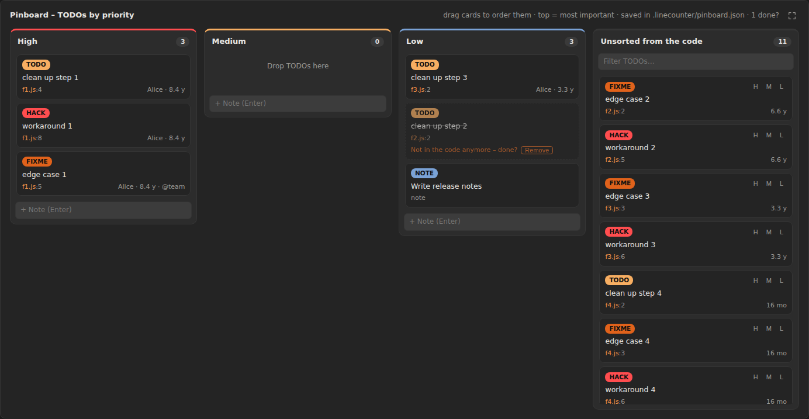

<p align="center"></p>

# LOComotive – Code Statistics, Lines of Code & Complexity

*Counts **L**ines **o**f **C**ode and rides through your project: full statistics, cyclomatic complexity, code health grading, secrets scanner, dependency licenses & vulnerability scanner (OSV), architecture rules, git ownership, TODO pinboard, MCP server with 22 LLM tools, quality gate for CI, interactive import graphs and a 3D train through your imports.*

> Formerly "Line Counter". Existing `.linecounter/` folders are still read, see [Migrating from Line Counter](#migrating-from-line-counter).

[](https://github.com/EinsPhoenix/linecounter/releases/latest)
[](https://github.com/EinsPhoenix/linecounter/releases/latest/download/locomotive.vsix)
[](https://github.com/EinsPhoenix/linecounter/actions/workflows/ci.yml)
[](CHANGELOG.md)
[](LICENSE)
[](#installation)

**⬇️ [Download latest version (`locomotive.vsix`)](https://github.com/EinsPhoenix/linecounter/releases/latest/download/locomotive.vsix)** · [All releases](https://github.com/EinsPhoenix/linecounter/releases) · [Changelog](CHANGELOG.md)

A VS Code extension that recursively displays all files and folders of your workspace as a tree in the sidebar. Filter your selection and generate a full-screen statistics page with a single click.


**Detailed description of every feature, what to expect and known limitations: [`docs/FEATURES.md`](docs/FEATURES.md)**

## At a Glance

| Area | What you get | More |
|---|---|---|
| Statistics | Lines, languages, treemap, Hall of Fame, rants, fun facts, file ranking | [FEATURES](docs/FEATURES.md#statistics-page) |
| Trends | Metrics from every run as a trend chart, changes since the last run | [FEATURES](docs/FEATURES.md#trends) |
| Code health | Cyclomatic complexity per function, risk hotspots (churn × complexity), unused functions, duplicates, secrets scanner | [FEATURES](docs/FEATURES.md#code-health) |
| Dependencies | Licenses of all packages (npm, PyPI, crates.io, Go), vulnerability scanner (OSV), unused and undeclared packages | [FEATURES](docs/FEATURES.md#dependencies-licenses-and-vulnerabilities) |
| Architecture | Rules like "`ui/` must not import `db/`" and layers; violations shown in red in the graph | [FEATURES](docs/FEATURES.md#architecture) |
| Git | Multi-repo overview, ownership and bus factor, stale files, TODO tracker with age, branch comparison | [FEATURES](docs/FEATURES.md#branch-comparison) |
| TODO Pinboard | Order TODOs by priority with drag & drop, click jumps to the code line, stored in `.locomotive/pinboard.json` | [FEATURES](docs/FEATURES.md#pinboard--todos-by-priority) |
| Graphs | Import graph with cycles, chains, functions, folder clusters and search; up to 20,000 nodes; 3D train through the project | [FEATURES](docs/FEATURES.md#graphs-2d) |
| Quality Gate | Same checks in VS Code and CI (`node bin/locomotive.js gate`, exit code 1) | [CI.md](docs/CI.md) |
| MCP Server | 22 tools for LLM agents (Copilot, Claude Code …): impact of a change, risk hotspots, vulnerabilities, licenses … | [MCP.md](docs/MCP.md) |
| Filters & Presets | Custom filters like `*/data`, presets and settings in `.locomotive/`, project root | [FEATURES](docs/FEATURES.md#sidebar-filters-and-presets) |

## Quick Start

1. **Install:** [Download `locomotive.vsix`](https://github.com/EinsPhoenix/linecounter/releases/latest/download/locomotive.vsix) and run `code --install-extension locomotive.vsix` (or *Extensions → … → Install from VSIX…*).
2. **Open:** Click the LOComotive icon in the Activity Bar. The sidebar shows your workspace's file tree.
3. **Filter:** Click to exclude folders and files, hide file types or load a preset.
4. **Analyze:** Click **Create Statistics**. The statistics page opens in full screen. Use the navigation at the top to jump to Languages, Dependencies, Code health, Git, Graphs …
5. **Share:** Export CSV, JSON, HTML or PDF from the top right. Settings and presets live in `.locomotive/` and can be committed to the repo.

## Screenshots

| | |
|---|---|
|  | **Sidebar:** File tree with search, predefined and custom filters, file types, presets and "Create Statistics". |
|  | **Import graph:** who imports whom, colored by folder, with cycles, longest chains and "blast radius". |
|  | **Dependency Express:** a 3D train rides along your imports through the project — every planet is a file. |
|  | **Treemap:** every rectangle is a file, grouped by folder, size = lines. |
|  | **Risk hotspots:** git churn × complexity shows where the next bug will appear. |
|  | **Licenses:** all packages from npm, PyPI, crates.io and Go by license and category. |
|  | **Ownership:** who owns the code, bus factor and knowledge lost with inactive authors. |
|  | **Git:** when code is written, commits per month, hotspots and fun facts. |
|  | **Pinboard:** order TODOs by priority (drag & drop), with a jump to the code line; stored in `.locomotive/pinboard.json`. |
|  | **Project roast:** your statistics with a sense of humor. |

More images and all details: [`docs/FEATURES.md`](docs/FEATURES.md)

## Choosing a Project Root

If VS Code has a parent folder open (e.g. `D:\CodingThings\Graphoenix`) and your actual projects live inside `Graphoenix\facgraph`, click the **target icon** on a folder in the sidebar. That folder becomes the project root: statistics, all paths, folder colors, clusters and planets are relative to it. ↑ goes one level up, ✕ resets to the whole workspace. The root is saved per workspace and in presets.

## Language Support (Summary)

- **Line counting:** 74 languages and file types
- **Import graph:** JS/TS (incl. `tsconfig` paths and `@/` aliases), Python, Rust, Go, C/C++, CSS/SCSS/Less, HTML
- **Functions & complexity:** JS/TS, Python, Rust, Go, Java, Kotlin, Scala, C#, C/C++, Swift, PHP, Ruby, Lua, Dart
- **Packages, licenses, vulnerabilities:** npm, PyPI, crates.io (Rust), Go modules

## Installation

1. Download the latest `locomotive.vsix` from the [release page](https://github.com/EinsPhoenix/linecounter/releases/latest) (or directly: [locomotive.vsix](https://github.com/EinsPhoenix/linecounter/releases/latest/download/locomotive.vsix)).
2. Install it:

```bash
code --install-extension locomotive.vsix
```

Alternatively in VS Code: *Extensions → "…" → Install from VSIX…*

## Downloads

| What | Where |
|---|---|
| Latest version | [Releases → latest](https://github.com/EinsPhoenix/linecounter/releases/latest) |
| Older versions | [All releases](https://github.com/EinsPhoenix/linecounter/releases) (tag `v<version>`, release notes from the changelog) |
| Directly in the repo | [`locomotive.vsix`](locomotive.vsix) (current) and [`releases/`](releases/) |
| For CI | `https://github.com/EinsPhoenix/linecounter/releases/latest/download/locomotive.vsix`, see [CI.md](docs/CI.md) |

Releases are created automatically: when a new version lands on `main` (`package.json` + `releases/locomotive-<version>.vsix`), the [`release.yml`](.github/workflows/release.yml) workflow creates the tag and release with the `.vsix`.

## Sidebar ("LOComotive" in the Activity Bar)

- **Tree of all files and folders** (recursive, multi-root workspaces are supported)
- **Clicking a file or folder excludes it** (strikethrough). Clicking again includes it. Use the arrow to expand/collapse folders; the arrow icon on the right opens the file.
- **Search bar**: filters the tree live. Wildcards (`*.test.js`, `?`) and paths (`src/utils`) work. *Exclude all* or *Include all* excludes or includes all matches at once.
- **Predefined filters** (checkboxes): `node_modules`, Python venv/caches (including venvs with custom names, detected via `pyvenv.cfg`), `.git`, build output (`dist`, `build`, `out`, `target`, …), IDE folders, `vendor`, lock files, minified files, binaries/media, and optionally everything in `.gitignore`.
  Excluded preset folders are not scanned, keeping large workspaces fast. Clicking such a folder loads and includes it.
- **File types**: all detected extensions as chips with counts. Click to show or hide a type; there are also *All*, *None* and *Invert*.
- The selection is saved per workspace.
- **Filter presets:** Save the current selection as a named preset via the preset bar: excluded files and folders, hidden file types and active predefined filters. You can load or delete presets. They are stored in `.locomotive/presets.json` in the workspace and can be committed and shared with the team. The active preset is the default state for new checkouts.
- **Custom exclude patterns:** `locomotive.excludePatterns` accepts glob patterns like `.gitignore` (`*.generated.ts`, `docs/`, `/build`, `src/**/*.spec.ts`). They appear as the "Custom patterns" filter.
- **Create Statistics** starts the analysis.

## Statistics Page (opens maximized or full screen)

The page uses a fixed color scheme of dark orange and gray with SVG icons. Only the Hall of Fame and the Code Rant use emojis. **Every chart** has a full-screen button in the top right; press `Esc` to return.

- **Overview**: total lines, code, comments, blank lines, files, folders, size, languages, avg lines/file, median, avg line length, estimated functions, imports, TODO/FIXME/HACK
- **Languages**: donut charts (lines, files, code/comment/blank), stacked bars per language, language table
- **Files and folders**: treemap of **all** files (canvas, grouped by folder, no aggregated "Other" block, smooth even with tens of thousands of files), largest files by lines and bytes, top folders, file extensions, file length distribution, last modified
  - **Treemap tile:** A **left click copies the path** to the clipboard, a double click opens the file.
  - **Right click** (also in ranking, bars and rant lists): open file, copy path / relative path, reveal in file manager or **delete file**. Deletion shows a confirmation dialog; the file goes to the trash or is permanently deleted.
- **Hall of Fame**: 18 categories with a podium (🥇🥈🥉), including longest and heaviest file, longest line (opens directly at that position), smallest file, deepest nesting, longest name, TODO collector, best documented, "Silent treatment" (lots of code, no comments), Function Factory, Debug-Print Champion, airiest and densest file, widest code, Whitespace Hoarder, Emoji Artist, newest file and Fossil. The hero card 🏆 shows the most decorated file.
- **Dependencies, licenses & vulnerabilities** (npm, Python, Rust, Go)
  - **Manifests:** `package.json`, `requirements*.txt`, `pyproject.toml` (PEP 621, Poetry, uv, PDM), `Pipfile`, `setup.py`, `setup.cfg`, `Cargo.toml` (+ `Cargo.lock`), `go.mod` (+ `go.sum`)
  - **Licenses of all packages:** If a license is unknown locally, the registry, the **package archive** (LICENSE files inside), deps.dev and the GitHub repository are checked in sequence. What was checked is shown in the *Unknown & custom licenses* card and the license PDF.
  - **Installed packages:** npm from `package-lock.json` or `node_modules`, Python from the virtual environment (`.venv`, `venv` or any folder with `pyvenv.cfg`) via `METADATA`, classifiers and license files. Without a venv, versions come from `Pipfile.lock`, `poetry.lock` or `uv.lock`.
  - **License report:** every package (direct and transitive) with normalized SPDX license, category (permissive, weak/strong/network copyleft, restricted, unknown) and status *problematic*, *review* or *ok*. Filtering and CSV export included. Which licenses are problematic is configurable in settings.
  - **Vulnerability report** via [OSV.dev](https://osv.dev): severity (also computed from CVSS v3), advisory link, CVE, summary and fixed version. Only package name and version are sent; can be disabled via `locomotive.vulnerabilities.enabled`.
  - **Unused & undeclared:** declared packages that are never imported, and imports of packages that are not declared. Heuristics cover CLI tools, plugins, `@types`, configuration files, npm scripts and differing Python import names (`PyYAML` → `yaml`, `Pillow` → `PIL`, …).
- **Code Rant** rants about files exceeding the line limit (default **500**) and files with more than **10 %** blank lines.
  - **Rant-o-Meter** (0–100) with moods from 😇 Zen to 🌋 Volcanic
  - **Metrics:** lines over the limit, unnecessary blank lines, worst offender 👑
  - **Escalation levels** for filtering: 🙄 Mild, 😤 Spicy, 🤬 Furious, 💀 Nuclear for overly long files and 🫧 Breezy, 🌬️ Drafty, 🏜️ Desert, 🕳️ Void for too many blank lines
  - **🔥 Project roast:** quips about comment ratio, file size, TODOs, language mix, tabs vs. spaces, bus factor, late-night commits and more
  - **🎁 Bonus rants:** very long lines, debug prints, TODO wishlists, uncommented code, trailing whitespace, mutual imports, import magnets
  - **💬 Commit message rant** (per repo): too short/long messages, flagged words (wip, asdf, tmp, final, please, …) with examples, repeated messages, SHOUTING, "!!" and "??", reverts, Friday evening commits, lowercase subjects, trailing periods
  - Every Hall of Fame winner gets their own roast.
  - Affected values are highlighted orange in the ranking.
- **Git** (repos are detected automatically, including nested ones): commits, contributors, first and last commit, project age, +/− lines, branches and tags, commits per month, heatmap by weekday × hour, top contributors, hotspots (most frequently changed files)
- **Git fun facts**: night-owl commits, weekend commits, longest commit streak, busiest day, bus factor, fix ratio, lazy commit messages, shortest and longest message, largest commit, favorite words
- **Fun facts**: printed pages and stack height, length of code in one line (× Eiffel Tower), typing time, "× Harry Potter", coffee consumption, COCOMO effort and cost, WTF/kLOC, documentation grade, tabs vs. spaces, debug prints, semicolons, trailing whitespace, occurrences of 42, emojis, tweets, floppy disks
- **Words & connections**
  - Word cloud of the most used identifiers
  - **Word Web:** an animated, jiggling force graph of the most frequent words and the files that use them most
  - **File connections:** a graph of who imports whom (JS/TS, Python, CSS/SCSS/Less, C/C++, HTML)
    - **Circular imports:** cycles of any length are detected (strongly connected components) and drawn **permanently in red** in the graph. The side panel lists every cycle with its path (`a.ts → b.ts → c.ts → a.ts`). Clicking traces it in red and zooms in.
    - **Dependency chains:** the longest import chains. Clicking highlights the chain in red with its path; the path can be copied.
    - **Clicking a file:** all files that (transitively) depend on it turn **red**, all dependencies turn **amber**. The status bar shows the counts, including project-wide totals.
    - **Biggest blast radius:** the files with the most dependents. Plus Most imported and Imports the most, and a file search.
    - **Layout:** *Force* or *Layered*. Layered shows importers at the top and imported files below, so chains flow top to bottom.
    - **Libraries as nodes:** Under the filters in the sidebar there is a *Show libraries as graph nodes* toggle. External npm and Python packages then become graph nodes: squares, and packages with known vulnerabilities as red skulls. Tooltip with version, license and vulnerabilities. They are not counted in any statistics.
    - **3D Train (Dependency Express):**
      - **World:** Files are planets (size by imports, red glow for cycles), libraries are metal cubes, vulnerable packages are skulls, and files importing vulnerable packages get a skull moon. Planets are widely spaced and do not overlap.
      - **Colors:** Planets in the same folder share the same color (legend bottom left), functions take the color of their file.
      - **Rails:** Every relationship is a glossy maglev guideway (Bézier curve) with neon edges in which light flows. They run **over** the planets: each relationship leaves the planet on its upper hemisphere toward the target, and at the pole all rails meet on a **turntable**. There they cross, and there the train switches relationships. Cycles have red rails, function calls amber ones.
      - **Train:** a streamlined maglev in chrome and clearcoat with a canopy cockpit, light strips, fin, winglets, twin thrusters and passenger pods with window strips. On planets the train aligns to the surface.
      - **Driven trail:** Already driven relationships are marked green. The more often you drive them, the thicker the line. *Trail* in the top bar shows the count and clears the trail.
      - **Functions (ƒ Functions):** When you enable functions in the graph or in the train's top bar, functions become crystal-shaped moons with their own rails (file → function, caller → callee). This lets you ride along files and functions. In Chain mode there is also the *Longest call chain* route.
      - **Labels** appear only for nearby objects, for what the camera is looking at, and for the stops on the route.
      - **Chain:** The train follows a chain or a loop (circular import) with stops. The destination is selectable.
      - **Free roam:** Start at the selected file or click *Free roam from here* on a planet.
      - **Manual:** **W** drives. The train stops at a junction portal. There you pick the relationship with **A**/**D** and must release and re-press **W**. With *Auto-choose: on* the train takes the straightest continuation without stopping instead. If there is only one continuation it goes straight ahead. Transitions between two relationships are smooth Bézier curves through the planet.
      - **S turns around:** The train briefly lifts off, rotates 180° with all cars and the camera, and lands on the opposite track. In Chain mode the train stays on the chain.
      - **Auto:** constant speed. In Free Roam the train picks a random relationship at junctions and prefers not to take the way it came from. In dead ends it turns around. The **Stop** slider sets the dwell time at each planet (0–5 s). At 0 the train drives through without braking.
      - **Fly (X):** The train detaches from the rails. **W** gives thrust, **S** brakes, **A**/**D** steer, **Q**/**E** climb or dive. **R** snaps back onto the nearest relationship; the train glides along a curve back onto the rail.
      - **Keys** can be changed with `locomotive.train.keys` (e.g. `{ "up": "r", "down": "f", "snap": "e" }`).
      - **Cameras:** Chase, Cab (cockpit, rotates with the train instead of the world) and Free cam. **C** switches, drag with the mouse to look around, scroll wheel zooms, ↑/↓ changes speed, space pauses, **Esc** exits.
    - **Motion:** *Wiggle*, *Calm* (settles down) or *Still* (static, no animation). Dragged nodes stay where you drop them in Calm and Still. Mutual imports are drawn as arcs.
  - All graphs support zoom, pan and drag. Hovering highlights neighbors. The buttons in the top right pause the animation, toggle wiggle, shake the graph and reset the zoom. The entrance animation starts when a graph scrolls into view.
    - **ƒ Functions:** Functions as diamond nodes in the graph, connected to their file and to the functions they call (only along actual imports, including JSX components). Double click opens the function at its line.
    - **Color:** *Folder* (files in the same folder share a color, functions take the color of their file) or *Language*.
    - **Cluster folders:** Files group by folder into labeled bubbles without overlap. Double clicking into a bubble zooms in.
    - **Search:** As you type, all matches are highlighted, the view zooms in, and Enter selects. Word Web and Structure also have a search field; the Structure search expands matching folders.
- **Code health**
  - Grade (A–F) and score as a gauge, plus functions, overly complex and overly long functions, share of duplicated code and found secrets
  - **Complexity per function** (cyclomatic, nested functions counted separately) for JS/TS, Python, Go, Rust, Java, C#, C/C++, Kotlin, Swift, PHP, Ruby and Lua. Charts for distribution, function length and hotspot files.
  - Table *Most complex*, *Longest*, *Too many parameters* with filters. Clicking jumps directly to the function.
  - **Duplicated code:** blocks of 6 or more identical (normalized) lines with both locations clickable
  - **Secrets scanner:** AWS, GitHub, GitLab, Slack, Stripe, Google, OpenAI, Anthropic, npm and SendGrid keys, private keys, JWTs, connection strings with passwords and hard-coded passwords (with entropy check). Values are masked.
  - Matching rants in the Code Rant section, plus a **Code Health PDF** and a **Secrets PDF**
- **Ranking table** of all files: sortable by any column, filterable by path and language. Clicking opens the file.
- **Project structure** (at the bottom): folders and files as a live force graph. Clicking a folder expands or collapses it, clicking a file opens it. Large projects start partially collapsed to keep the graph smooth.
- **PDF export:** Choose sections, paper format (A4 or Letter), dark or light print-friendly theme and a cover page with key metrics. There are also separate PDFs for the **license report**, the **vulnerability report**, the **code health report** and the **secrets report** (searchable tables with recommendations).
- **HTML report:** a single, interactive HTML file that works in any browser without VS Code
- Export as **CSV** or **JSON**, *Refresh*, *Maximize*, *Full screen*

## Settings

All settings can also be set per project in **`.locomotive/settings.json`**. These values take precedence over VS Code settings. The command *LOComotive: Open Workspace Settings* (gear icon in the sidebar) creates the file with the current values. Autocompletion and validation are provided by a JSON schema. Keys work with or without the `locomotive.` prefix, nested keys are supported, and comments are allowed. Changes to the file take effect immediately.

```jsonc
// .locomotive/settings.json
{
  "rant.maxFileLines": 400,
  "rant.maxBlankPercent": 15,
  "excludePatterns": ["*.generated.ts", "docs/"]
}
```

| Setting | Default | Description |
|---|---|---|
| `locomotive.statisticsLayout` | `maximized` | `maximized` hides sidebars and panel, `fullscreen` additionally enters full-screen mode, `normal` opens as a regular tab |
| `locomotive.rant.enabled` | `true` | Show the "Code Rant" section |
| `locomotive.rant.maxFileLines` | `500` | Rant about files longer than this many lines |
| `locomotive.rant.maxBlankPercent` | `10` | Rant when more than this percentage of lines are blank (files with 10+ lines and the overall project) |
| `locomotive.rant.commitMinLength` | `10` | Commit messages shorter than this get a rant |
| `locomotive.rant.commitMaxLength` | `72` | Commit messages longer than this get a rant |
| `locomotive.rant.commitWords` | `[]` | Words that trigger a commit-message rant (empty means the built-in list) |
| `locomotive.excludePatterns` | `[]` | Additional glob patterns to exclude |
| `locomotive.defaultFilters` | all | Predefined filters active in a new workspace |
| `locomotive.graphs.motion` | `auto` | `auto` (Word Web wiggles, other graphs are calm), `wiggle`, `calm` or `still` |
| `locomotive.dependencies.enabled` | `true` | Dependency, license and vulnerability report |
| `locomotive.licenses.problematic` | `GPL*`, `AGPL*`, `SSPL*`, `CC-BY-NC*`, `BUSL*`, `Proprietary` | Licenses marked as problematic (SPDX with `*`) |
| `locomotive.licenses.review` | `LGPL*`, `MPL*`, `EPL*`, `CDDL*`, `EUPL*`, `CC-BY-SA*`, `Unknown`, `Custom` | Licenses that need a review |
| `locomotive.licenses.allowed` | `[]` | Optional allowlist; everything else is then problematic |
| `locomotive.licenses.ignorePackages` | `[]` | Accepted exceptions |
| `locomotive.licenses.includeTransitive` | `true` | Include transitive packages in the license report |
| `locomotive.vulnerabilities.enabled` | `true` | Check for vulnerabilities via OSV.dev |
| `locomotive.vulnerabilities.includeTransitive` | `true` | Also check transitive packages |
| `locomotive.licenses.fetchFromRegistry` | `true` | Fetch licenses of non-installed packages from the npm / PyPI registry |
| `locomotive.health.enabled` | `true` | Code health: complexity, long functions, duplicated code |
| `locomotive.health.maxComplexity` | `15` | Functions with cyclomatic complexity above this are considered too complex |
| `locomotive.health.maxFunctionLines` | `80` | Functions longer than this are considered too long |
| `locomotive.health.duplicateMinLines` | `6` | Minimum length of duplicated blocks |
| `locomotive.secrets.enabled` | `true` | Scan for hard-coded secrets |
| `locomotive.secrets.ignore` | Tests, examples | Glob patterns for files not scanned for secrets |
| `locomotive.graphs.maxFunctions` | `600` | Maximum number of functions in the graph and 3D train |
| `locomotive.train.keys` | W/S/A/D, Q/E, R, X, C | Key bindings for the 3D train (`forward`, `back`, `left`, `right`, `up`, `down`, `snap`, `fly`, `camera`) |
| `locomotive.maxFileSizeKB` | `2048` | Larger files are counted by size only |
| `locomotive.maxEntries` | `200000` | Maximum number of scanned entries |
| `locomotive.maxCommits` | `20000` | Maximum number of commits read per repo |

## Development

Pure JavaScript, no build step. d3 (ISC license) ships pre-built in `media/vendor/`; the webview loads nothing from the internet.

```bash
npm install
npm test          # Smoke test (scanner, analyzer, git, aggregation)
npm run release   # creates releases/locomotive-<version>.vsix and updates locomotive.vsix
```

To publish a new version: bump the version in `package.json`, add an entry in `CHANGELOG.md`, run `npm run release`, commit and push to `main`. The rest (tag, GitHub Release, assets) is handled by GitHub Actions.

To debug, open the folder in VS Code and launch an Extension Development Host with `F5`.

```
src/extension.js       Activation and commands
src/config.js          .locomotive/settings.json + presets.json (overrides, presets, file watcher)
src/sidebarProvider.js Sidebar webview, scan, presets
src/statistics.js      "Create Statistics" flow (analysis, git, aggregation)
src/util.js            Open file, glob → RegExp
src/deps/              Dependency scanner: manifests, installed, licenses, vulns (OSV + CVSS), usage
src/scanner.js     Recursive scan and predefined filters
src/analyzer.js    Line classification (code/comment/blank) and per-file metrics
src/languages.js   Language detection and comment syntax
src/git.js         Git analysis (log, shortstat, hotspots, commit rant, …)
src/graphs.js      Data for Word Web and import graph
src/stats.js       Aggregation for the statistics page
src/statsPanel.js  Webview panel (full screen, open file, export)
media/             Webview UI (sidebar, statistics page, graphs.js = canvas treemap + force graphs)
```

## License

[MIT](LICENSE)

## Migrating from Line Counter

Since version 2.0.0 the extension is called **LOComotive** (ID `einsphoenix.locomotive`). Because the ID changed, VS Code treats it as a new extension:

1. Uninstall the old "Line Counter" extension, then install LOComotive.
2. **Project folder:** An existing `.linecounter/` (settings, presets, filters, pinboard, history) is automatically used as long as there is no `.locomotive/`. To switch, simply rename the folder to `.locomotive`. Keys with the old prefix (`"linecounter.train.maxNodes"`) in that folder's `settings.json` continue to work.
3. **VS Code settings:** Values with the old prefix `linecounter.*` in User/Workspace Settings are still read as long as the new key is not set. It is recommended to rename them (e.g. `linecounter.graphs.maxNodes` → `locomotive.graphs.maxNodes`) so they also appear in the Settings editor.
4. **CLI and MCP:** `bin/linecounter.js` is now `bin/locomotive.js`, the MCP server is `bin/locomotive-mcp.js`, the environment variable is `LOCOMOTIVE_ROOT`.

## ☕ Support

If LOComotive is helpful to you, I'd appreciate a small donation:

[](https://www.paypal.com/donate/?hosted_button_id=JFUZJFFH5X97N)
