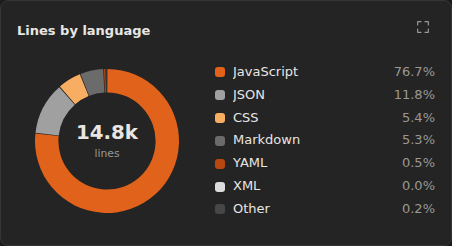
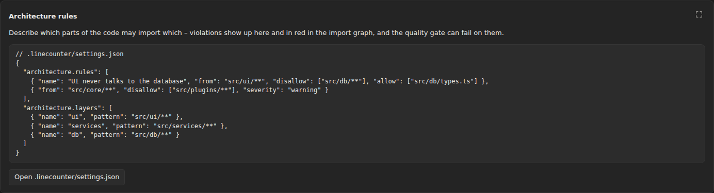
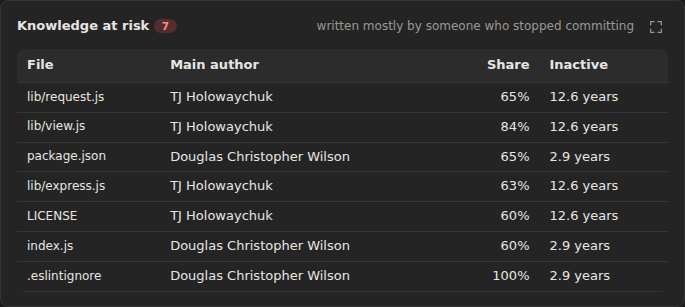
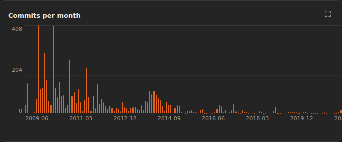
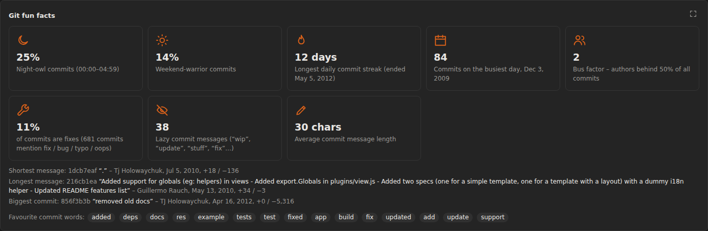
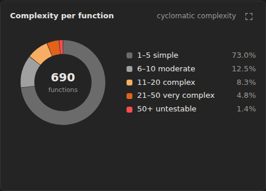
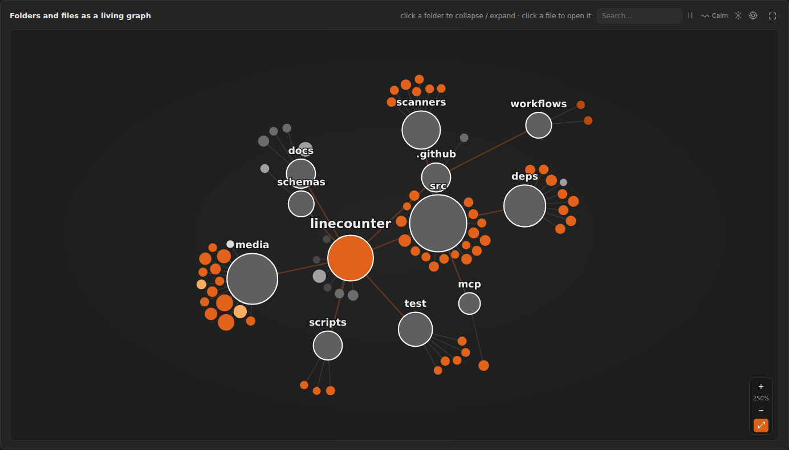

# LOComotive – Funktionen im Detail

Diese Seite beschreibt, **was jede Funktion macht, was du erwarten kannst und wo die Grenzen liegen**. Eine Kurzfassung steht in der [README](../README.md).

---

## Inhalt

1. [Sprachunterstützung](#sprachunterstützung)
2. [Sidebar, Filter und Presets](#sidebar-filter-und-presets)
3. [Statistik-Seite](#statistik-seite)
4. [Trends](#trends)
5. [Architecture](#architecture)
6. [Branch comparison](#branch-comparison)
7. [TODO tracker](#todo-tracker)
8. [Ownership (Git)](#ownership-git)
9. [Code health](#code-health)
10. [Dependencies, Lizenzen und Schwachstellen](#dependencies-lizenzen-und-schwachstellen)
11. [Graphen (2D)](#graphen-2d)
12. [Dependency Express (3D-Zug)](#dependency-express-3d-zug)
13. [Quality Gate (CI)](#quality-gate-ci)
14. [MCP-Server für LLM-Agenten](#mcp-server-für-llm-agenten)
15. [Exporte und PDFs](#exporte-und-pdfs)
16. [Was die Extension nicht macht](#was-die-extension-nicht-macht)

---

## Sprachunterstützung

**Zeilen zählen** (Code-, Kommentar- und Leerzeilen) funktioniert für 74 Sprachen und Dateitypen, unter anderem JavaScript, TypeScript, Python, Java, Kotlin, C, C++, C#, Go, Rust, Swift, PHP, Ruby, Lua, Dart, SQL, Shell, HTML, CSS, YAML, JSON, Markdown und Dockerfile.

Die tieferen Analysen unterscheiden sich je nach Sprache:

| Sprache | Importgraph | Funktionen & Komplexität | Aufrufe zwischen Funktionen | Pakete, Lizenzen, Schwachstellen |
|---|---|---|---|---|
| JavaScript / TypeScript / JSX / TSX / Vue / Svelte | ✅ relative Pfade, `tsconfig`/`jsconfig` `paths` + `baseUrl`, Vite-/Webpack-Aliase, `@/`-Konvention | ✅ Funktionen, Arrow-Funktionen, Methoden, Generics, `useCallback`/`memo`-Wrapper | ✅ inkl. JSX (`<Komponente />`) | ✅ npm (`package.json`, Lockfiles von npm, pnpm und yarn, Workspaces) |
| Python | ✅ absolute und relative Imports | ✅ `def`, `async def` | ✅ | ✅ PyPI (`requirements*.txt`, `pyproject.toml` (PEP 621, Poetry, uv, PDM), `Pipfile`, `setup.py`, `setup.cfg`) |
| Rust | ✅ `mod x;`, `use crate::…`, `use super::…`, `use self::…` | ✅ `fn` | ✅ | ✅ crates.io (`Cargo.toml`, `Cargo.lock`) |
| Go | ✅ Paket-Imports über den Modulpfad aus `go.mod` | ✅ `func`, Methoden | ✅ | ✅ Go-Module (`go.mod`, `go.sum`) |
| Java, Kotlin, Scala, C#, C, C++, Swift, PHP, Ruby, Lua, Dart | C/C++: `#include "…"`, sonst – | ✅ | ✅ (Namensabgleich in derselben Datei) | – |
| CSS / SCSS / Less, HTML | ✅ `@import`, `@use`, `<script src>`, `<link href>` | – | – | – |

**Was du erwarten kannst:** Die Analyse arbeitet mit robusten Mustern, nicht mit einem vollständigen Compiler. Bei üblichem Code ist das sehr genau. Bei exotischer Syntax (Makros, generierter Code, stark verschachtelte Template-Literale) kann einmal eine Funktion fehlen oder eine Grenze leicht verrutschen.

---

## Sidebar, Filter und Presets


- **Baum aller Dateien und Ordner.** Ein Klick schließt eine Datei oder einen Ordner aus oder nimmt sie wieder auf.
- **Suche.** Filtert den Baum live.
- **Vordefinierte Filter.** Schließen typische Ordner aus, etwa `node_modules`, `venv`, `.git`, Build-Ordner und Caches.
- **`.gitignore`** wird optional beachtet.
- **Dateiendungen.** Alle erkannten Endungen lassen sich einzeln ein- und ausblenden.
- **Eigene Filter.**
  - Unter *Predefined filters → My filters* legst du eigene Filter an: ein Muster (oder mehrere, durch Komma getrennt) und ein optionaler Name, z. B. `*/data`, `*.generated.ts` oder `docs/`.
  - `*/data` bzw. `**/data` trifft jeden Ordner namens `data` in jeder Tiefe.
  - Jeder Filter ist eine eigene Checkbox, wird in Presets mitgespeichert und landet in `.locomotive/filters.json`, sodass das Team ihn teilen kann.
  - Aus einer Suche in der Sidebar machst du mit *Save as filter* direkt einen Filter.
  - Filter aus der Einstellung `locomotive.customFilters` (`[{ "label": "…", "patterns": ["…"] }]`) erscheinen ebenfalls.
- **Projekt-Root.** Liegen die eigentlichen Projekte tiefer als der in VS Code geöffnete Ordner (z. B. `Graphoenix` ist geöffnet, die Projekte liegen in `Graphoenix/facgraph/…`), klickst du auf einem Ordner auf das Ziel-Symbol. Dann gilt:
  - Der Baum zeigt nur noch diesen Ordner.
  - Die Statistik zählt nur seine Dateien.
  - Alle Pfade, Ordner-Diagramme, Ordnerfarben, Cluster und Planeten beziehen sich auf ihn. Die Unterordner werden so zu eigenen Gruppen, statt alles unter `facgraph/` zusammenzufassen.
  - Die Leiste *Project root* zeigt den Pfad; ↑ geht eine Ebene höher, ✕ analysiert wieder den ganzen Workspace.
  - Der Root wird im Workspace und in Presets gespeichert.
  - Git-Repos werden weiterhin erkannt, auch wenn sie höher liegen.
- **Presets.** Ausgeschlossene Dateien, Filter und Endungen speicherst du als benanntes Preset in `.locomotive/presets.json`. Die Datei kann ins Repo, damit das ganze Team dieselben Einstellungen nutzt.
- **Bibliotheken als Graph-Knoten.** Externe Pakete erscheinen dann im Graphen und im 3D-Zug. In Statistiken zählen sie nicht.

---

## Statistik-Seite





Die Seite öffnet sich maximiert oder im Vollbild. Jedes Diagramm hat einen eigenen Vollbild-Knopf.

| Bereich | Was du bekommst |
|---|---|
| Overview | Zeilen, Code, Kommentare, Leerzeilen, Dateien, Ordner, Größe |
| Languages | Anteile pro Sprache und Endung |
| Files | Treemap aller Dateien, gruppiert nach Ordner. Klick kopiert den Pfad, das Kontextmenü öffnet oder löscht die Datei. |
| Hall of Fame | 18 Kategorien (längste Datei, längste Zeile, meiste TODOs …) mit Podest und Roast |
| Dependencies | siehe [unten](#dependencies-lizenzen-und-schwachstellen) |
| Code health | siehe [unten](#code-health) |
| Code Rant | Rant-o-Meter, Rants über lange Dateien, zu viele Leerzeilen, Commit-Messages, Abhängigkeiten und Code health |
| Git | Commits, Autoren, Heatmap, Hotspots, Bus-Factor; Repos werden automatisch erkannt. Bei mehreren Repos: Übersichtstabelle (Branch, Commits, Autoren, letzter Commit, Aktivität der letzten 12 Monate, Bus-Factor, inaktive Repos ausgegraut, sortierbar), gemeinsames Commit-Diagramm, Repo-Umschalter für die Details und ein Repo-Filter in der Rangliste |
| Fun facts | gedruckte Seiten, Tippzeit, COCOMO, Kaffee … |
| Words & connections | Word Cloud, Word Web und Importgraph |
| Ranking | sortierbare Tabelle aller Dateien; ein Klick öffnet die Datei |
| Structure | Ordner und Dateien als Graph, Ordner klappen auf und zu |

Alle Grenzwerte (z. B. ab wie vielen Zeilen eine Datei „zu lang“ ist) stehen in den Einstellungen bzw. in `.locomotive/settings.json`.

---

## Trends

- **Snapshot pro Lauf.** Jeder Lauf speichert die Kennzahlen pro Workspace bzw. Projekt-Root: Zeilen, Funktionen, Komplexität, Health-Score, Duplikate, ungenutzte Funktionen, TODOs, Schwachstellen, Lizenzprobleme, Secrets, Zyklen und Commits.
- **„Since the last run“.** Zeigt die Änderungen seit dem letzten Lauf. Grün heißt besser, rot heißt schlechter.
- **Kurven.** Für jede Kennzahl, die sich verändert hat, gibt es eine Verlaufskurve.
- **Zusammenfassen.** Läufe innerhalb von 10 Minuten werden zusammengefasst.
- **Speicherort.** Gespeichert wird lokal im Workspace-State (`locomotive.history.enabled`). Mit `locomotive.history.saveToFile` landet die Historie zusätzlich in `.locomotive/history.json` und kann mit dem Team geteilt werden. *Clear history* setzt sie zurück.

## Architecture



- **Regeln** in `.locomotive/settings.json` oder den VS-Code-Einstellungen:
  ```jsonc
  "architecture.rules": [
    { "name": "UI never talks to the database", "from": "src/ui/**", "disallow": ["src/db/**"], "allow": ["src/db/types.ts"] },
    { "from": "src/core/**", "disallow": ["src/plugins/**"], "severity": "warning" }
  ],
  "architecture.layers": [
    { "name": "ui", "pattern": "src/ui/**" }, { "name": "services", "pattern": "src/services/**" }, { "name": "db", "pattern": "src/db/**" }
  ]
  ```
- **`rules`:** Dateien, die zu `from` passen, dürfen nichts importieren, was zu `disallow` passt. Ausnahmen trägst du in `allow` ein.
- **`layers`:** Die Schichten sind von oben nach unten sortiert. Eine Schicht darf nur Schichten darunter importieren.
- **Geprüft** wird jeder echte Import (JS/TS mit Aliasen, Python, Rust, Go, C/C++, CSS). Die Pfade sind relativ zum Projekt-Root.
- **Anzeige.**
  - Die Sektion *Architecture* zeigt Verstöße pro Regel; ein Klick auf eine Regel filtert die Liste.
  - *Show in import graph* markiert die verletzenden Kanten pink-rot im Graphen.
  - Verstöße erzeugen einen Rant und können das Quality Gate scheitern lassen.

## Branch comparison

- **Automatisch.** Bist du nicht auf dem Basis-Branch, vergleicht die Statistikseite den aktuellen Stand (HEAD plus uncommittete Änderungen) mit dem Merge-Base des Basis-Branches. Die Basis wird automatisch bestimmt (`origin/HEAD`, `main`, `master` oder `develop`) oder fest über `locomotive.compare.baseBranch` gesetzt.
- **Manuell.** Jeder andere Branch lässt sich in der Auswahl wählen, dann *Compare*.
- **Was du siehst.**
  - Commits ahead und behind, geänderte Dateien mit ± Zeilen sowie Komplexität vorher und nachher pro Datei.
  - Neue und komplexer gewordene Funktionen.
  - Neue TODOs und **neue Secrets** in den hinzugefügten Zeilen.
  - Geänderte Abhängigkeiten aus `package.json`, `requirements`, `pyproject.toml`, `Cargo.toml` und `go.mod`.
  - Die Commits des Branches mit Autoren.
- **Abschalten:** `locomotive.compare.enabled`.

## TODO tracker

- **Was gefunden wird.** Jeder Kommentar mit `TODO`, `FIXME`, `HACK`, `XXX` oder `BUG`. Eine Zuweisung wie `TODO(alice):` wird als `@alice` angezeigt.
- **Alter und Autor.** Kommen aus `git blame` der jeweiligen Zeile. Noch nicht committete Zeilen sind als „new“ markiert.
- **Anzeige.**
  - Kennzahlen: Anzahl, ältester TODO, Durchschnittsalter.
  - Diagramme: Alter, Tag, Autor.
  - Tabelle: älteste zuerst, filterbar nach Tag und Text; ein Klick springt zur Zeile.
- **Abschalten:** `locomotive.todos.enabled`.

### Pinboard – TODOs nach Priorität


Oben im TODO-Bereich der Statistik-Seite liegt ein Pinboard mit den Spalten **High**, **Medium** und **Low**. Oben in einer Spalte steht das Wichtigste.

- **Einsortieren.** Rechts stehen alle TODOs aus dem Code, die noch nicht auf dem Board sind („Unsorted from the code“, filterbar). Ziehe sie per Drag & Drop in eine Spalte oder klicke auf **H / M / L**.
- **Reihenfolge ändern.** Karten per Drag & Drop verschieben oder über die Pfeile: ▲ ▼ ändert die Reihenfolge, ◀ ▶ die Spalte. ✕ nimmt ein TODO vom Board (zurück zu „Unsorted“) oder löscht eine Notiz.
- **Sprung in den Code.** Jede Code-Karte zeigt `datei:zeile`; ein Klick öffnet die Datei an genau dieser Zeile.
- **Notizen.** Über „+ Note“ legst du Aufgaben an, die nicht im Code stehen.
- **Gespeichert in `.locomotive/pinboard.json`** im Workspace, direkt nach jeder Änderung. Die Datei kann ins Repo, dann teilt das Team dieselbe Reihenfolge.
- **Robust gegen Code-Änderungen.** Karten werden über Datei, Tag und Text wiedererkannt, nicht über die Zeilennummer. Wandert ein TODO nach unten, zeigt die Karte die neue Zeile. Ist der Kommentar verschwunden, wird die Karte durchgestrichen („Not in the code anymore – done?“) und kann entfernt werden.
- **Für LLM-Agenten.** Das MCP-Tool `todo_pinboard` liefert die Prioritäten, damit ein Agent weiß, woran als Nächstes gearbeitet werden soll.

Aufbau der Datei:

```json
{
  "columns": [{ "id": "high", "title": "High" }, { "id": "medium", "title": "Medium" }, { "id": "low", "title": "Low" }],
  "cards": [
    { "id": "todo-…", "column": "high", "kind": "code", "path": "src/parser.js", "tag": "TODO", "text": "handle empty input", "line": 42 },
    { "id": "note-…", "column": "low", "kind": "note", "text": "Write release notes" }
  ]
}
```

Die Spalten lassen sich in der Datei umbenennen oder ergänzen (z. B. „Next sprint“).

## Ownership (Git)









- **Who owns the code.** Pro Datei zählt als Hauptautor, wer die meisten Commits auf ihr hat. Gleiche Namen in anderer Schreibweise werden zusammengefasst, Bots (dependabot, renovate …) ignoriert. Daraus entsteht pro Person die Summe der Zeilen.
- **Ownership pro Ordner.** Ein farbiger Balken zeigt die Anteile der Autoren, dazu den Bus-Factor (wie viele Personen die Hälfte geschrieben haben). Ordner mit Bus-Factor 1 sind rot.
- **Stale files.** Dateien ohne Commit seit `locomotive.ownership.staleDays` Tagen (Standard 365). Werden sie noch gebraucht?
- **Knowledge at risk.** Dateien, die zu mindestens 60 % von jemandem stammen, der seit mehr als 6 Monaten nicht mehr committet.
- **Alter der letzten Änderung** pro Datei als Diagramm, dazu Rants.

## Code health




- **Note A–F und Score 0–100.**
  - Abzüge gibt es für zu komplexe Funktionen, zu lange Funktionen, duplizierten Code und Secrets.
  - Die Note ist ein Trend-Indikator, kein Qualitätsurteil über ein einzelnes Projekt.
- **Zyklomatische Komplexität pro Funktion.**
  - Gezählt werden 1 + Verzweigungen (`if`, `for`, `while`, `case`, `catch`, `&&`, `||`, `?:`, `??`).
  - Verschachtelte Funktionen werden separat gemessen und zählen nicht doppelt.
  - Der Grenzwert ist einstellbar: `locomotive.health.maxComplexity`, Standard 15.
- **Lange Funktionen.**
  - Grenzwert: `locomotive.health.maxFunctionLines`, Standard 80.
  - Funktionen mit 6 oder mehr Parametern werden ebenfalls gelistet.
- **Hotspots.** Dateien mit der höchsten Gesamtkomplexität. Ein Klick öffnet die Datei, ein Klick auf eine Funktion springt direkt zur Zeile.
- **Risiko-Hotspots (Churn × Komplexität).**
  - Ein Streudiagramm zeigt, wie oft eine Datei in Git geändert wurde (x) und wie komplex sie ist (y); die Punktgröße steht für die Dateilänge.
  - Rechts oben liegen die Dateien, die am wahrscheinlichsten den nächsten Bug enthalten.
  - Score 0–100, ein Klick öffnet die Datei. Dafür braucht es ein Git-Repo mit Historie.
- **Möglicherweise ungenutzte Funktionen.**
  - Gemeldet werden freistehende Funktionen, deren Name sonst nirgends im analysierten Code vorkommt.
  - Ausgelassen werden Methoden und Objekt-Properties (oft von Frameworks aufgerufen), Funktionen mit Decorator oder Annotation (Route-Handler, `@Override`), Tests sowie bekannte Einstiegspunkte (`main`, `activate`, Lifecycle-Hooks).
  - Exportierte Funktionen sind markiert, weil sie öffentliche API einer Bibliothek sein können.
- **Duplizierter Code.**
  - Gefunden werden Blöcke ab 6 identischen Zeilen; dabei werden Leerraum und Kommentare ignoriert und triviale Zeilen übersprungen.
  - Beide Fundstellen sind anklickbar.
  - Umbenannte Variablen erkennt die Analyse nicht als Duplikat; das ist bewusst so, um Fehlalarme zu vermeiden.
- **Secrets-Scanner.**
  - Erkannt werden AWS-, GitHub-, GitLab-, Slack-, Stripe-, Google-, OpenAI-, Anthropic-, npm-, SendGrid- und Twilio-Keys, Private Keys, JWTs, Connection-Strings mit Passwort und hart codierte Passwörter.
  - Bei Passwörtern prüft der Scanner die Entropie, damit Platzhalter wie `changeme` nicht auffallen.
  - Werte werden **immer maskiert**.
  - Test- und Beispieldateien sind über `locomotive.secrets.ignore` ausgenommen.
- **PDFs:** Code-Health-Report und Secrets-Report.

---

## Dependencies, Lizenzen und Schwachstellen


- **Ökosysteme:** npm, PyPI, crates.io (Rust), Go-Module. Direkte und transitive Pakete werden erfasst; Versionen kommen aus Lockfiles bzw. installierten Paketen.
- **Lizenzen aller Pakete.** Für jedes Paket mit unbekannter oder nicht standardmäßiger Lizenz läuft eine Kette von Quellen. Jeder Versuch wird protokolliert und in der Karte *Unknown & custom licenses* angezeigt.
  1. Lokale Metadaten: `node_modules`, `site-packages` (METADATA, Classifiers, License-Expression), Cargo-Cache, Go-Modul-Cache, LICENSE-Dateien
  2. Registry: registry.npmjs.org, pypi.org, crates.io, proxy.golang.org
  3. Das **Paket-Archiv selbst** (`.tgz`, Wheel, sdist, `.crate`, Go-`.zip`): LICENSE-, COPYING- und NOTICE-Texte sowie die Lizenzfelder darin
  4. deps.dev (Open Source Insights von Google)
  5. Die GitHub-Lizenz des Repositorys
- **Wann ein Paket „Unknown“ bleibt:** Nur wenn keine Quelle etwas liefert, z. B. bei privaten Paketen oder einem Tippfehler im Namen (Registry meldet 404). „Custom“ heißt: Es gibt einen Lizenztext, aber keine Standardlizenz. Beide brauchen eine manuelle Prüfung.
- **Lizenz-Policy.** Was als problematisch gilt bzw. ein Review braucht, stellst du in `locomotive.licenses.problematic`, `.review` und `.allowed` ein (Globs wie `GPL*`). Bei `MIT OR GPL` zählt die beste Option, bei `AND` die schlechteste.
- **Schwachstellen.** Abgefragt über OSV.dev für alle vier Ökosysteme, mit CVSS-Score, Advisory-Link und der Version, die den Fehler behebt.
- **Dependency hygiene.**
  - Deklarierte, aber nie importierte Pakete: Ein Klick springt zur Zeile im Manifest.
  - Importierte, aber nicht deklarierte Pakete: mit Liste der Dateien, die sie verwenden.
  - CLI-Tools (pytest, ruff, …) und Plugins in Configs werden berücksichtigt.
- **Netzwerk.** Die Online-Abfragen lassen sich abschalten (`locomotive.licenses.fetchFromRegistry`, `locomotive.vulnerabilities.enabled`). Dann bleiben nur lokale Informationen.

---

## Graphen (2D)




- **Word Web.** Die häufigsten Bezeichner und die Dateien, die sie verwenden.
- **Importgraph.** Wer importiert wen.
  - Zirkuläre Imports sind rot, die längsten Ketten werden hervorgehoben.
  - Ein Klick auf eine Datei zeigt alle Abhängigkeiten (bernsteinfarben) und alle Abhängigen (rot).
  - **Farbe: Folder oder Language.** Bei *Folder* haben Dateien desselben Ordners dieselbe Farbe, Funktionen die Farbe ihrer Datei.
  - **Cluster folders.** Dateien gruppieren sich pro Ordner in Blasen mit Beschriftung. Die Blasen überlappen nicht, und Querverbindungen ziehen kaum noch. Ein Doppelklick in eine Blase zoomt hinein.
  - **ƒ Functions.** Funktionen werden zu Rauten. Sie sind mit ihrer Datei verbunden und mit den Funktionen, die sie aufrufen; Aufrufe zählen nur entlang echter Imports, so bleibt die Zuordnung verlässlich.
  - **Suche.** Beim Tippen werden alle Treffer (Dateien und Funktionen) markiert, die Ansicht zoomt hin, und Enter wählt den Treffer aus.
- **Structure.** Ordner und Dateien als Graph. Die Suche klappt automatisch die Ordner auf, in denen Treffer liegen.
- **Zoom.**
  - Mausrad und Touchpad zoomen fein zum Mauszeiger; Pinch-Zoom geht schneller.
  - Rechts unten gibt es **+ / − / ⤢** und die aktuelle Zoomstufe.
  - Tastatur über dem Graphen: **+**, **−** und **0** (alles einpassen).
  - Doppelklick auf eine freie Fläche zoomt hinein, Shift + Doppelklick heraus.
  - Der Zoombereich reicht von 2 % bis 4000 %.
- **Große Graphen.**
  - Die Limits sind einstellbar: `locomotive.graphs.maxNodes` (Standard **20.000**) und `locomotive.graphs.maxLinks` (Standard **40.000**). Zyklen werden immer gezeigt.
  - Ab etwa 2.500 Knoten wird nur noch der sichtbare Ausschnitt gezeichnet, Beschriftungen erscheinen beim Hineinzoomen, und ab 4.000 Knoten wird das Layout einmal berechnet statt animiert. Ein Test mit 20.000 Knoten und 40.000 Relationen lief flüssig.
  - Der 3D-Zug hat eigene Limits, weil das 3D-Layout quadratisch wächst und jede Schiene GPU-Speicher kostet:
    - `locomotive.train.maxNodes`: Planeten, Standard **800**. Behalten werden die am stärksten vernetzten Dateien.
    - `locomotive.train.maxLinks`: Relationen als Schienen, Standard **2.400**. Vorrang haben Zyklen, Abhängigkeitsketten und Relationen zu verwundbaren Bibliotheken, danach die am stärksten vernetzten.
    - `locomotive.train.detail`: `auto` (Standard; ab 300 Planeten oder 900 Relationen gröbere Schienen, Planeten und Drehscheiben), `high` (immer volle Details) oder `low` (immer reduziert, für schwache GPUs).
  - Bleibt die 3D-Ansicht grau oder langsam, senke `train.maxLinks` / `train.maxNodes` oder stelle `train.detail` auf `low`.
- **Bewegung.** *Wiggle*, *Calm* oder *Still*, einstellbar über `locomotive.graphs.motion`.

---

## Dependency Express (3D-Zug)


Ein Zug fährt durch dein Projekt als Universum.

- **Welt.**
  - Dateien sind Planeten. **Planeten desselben Ordners haben dieselbe Farbe**; die Legende unten links zeigt die Ordner.
  - Bibliotheken sind Metallwürfel, verwundbare Pakete Totenköpfe.
  - Funktionen sind Kristalle in der Farbe ihrer Datei.
- **Gleise.**
  - Jede Beziehung ist eine glänzende Magnetschwebe-Führungsschiene mit Neon-Kanten, in denen Licht fließt.
  - Die Schienen laufen **über** die Planeten; oben am Pol kreuzen sie sich auf einer Drehscheibe.
  - Zyklen sind rot, Funktionsaufrufe hell bernsteinfarben.
- **Zug.**
  - Stromlinien-Lok in Chrom und Klarlack mit Cockpit-Kuppel, Leuchtlinien, Finne, Winglets und Doppel-Triebwerk; dazu Passagier-Pods mit Fensterbändern.
  - Der Zug schwebt leicht. Beim Wenden hebt er ab und dreht sich mit allen Waggons.
- **Gefahrene Strecke.**
  - Jede gefahrene Beziehung und jeder Weichenweg wird **grün** markiert. Je öfter du einen Abschnitt fährst, desto **dicker** wird die Linie.
  - Der Button *Trail* zeigt, wie viele Beziehungen du schon gefahren bist, und löscht die Spur.
- **Modi.**
  - **Chain:** fährt Ketten, Ringlinien (Zyklen), die längste Aufrufkette oder eine Grand Tour.
  - **Free roam:** W fährt, an Weichen wählst du mit A/D. Hast du *Auto-choose* an, nimmt der Zug ohne Halt die geradeste Fortsetzung.
  - **Fly:** Der Zug verlässt die Gleise. W/S steuern Schub und Bremse, A/D lenken, Q/E steigen und sinken, R rastet wieder ein.
- **Auto-Pilot.** Fährt mit konstanter Geschwindigkeit. Die Haltezeit pro Planet stellst du von 0 bis 5 Sekunden ein; bei 0 fährt der Zug ohne Bremsen durch.
- **Kameras.**
  - **Chase:** folgt dem Zug von hinten.
  - **Cab:** Führerstand; die Kamera dreht sich mit dem Zug.
  - **Free cam:** frei im Raum.
- **Tasten** lassen sich über `locomotive.train.keys` ändern.

**Leistung:** Bei sehr großen Projekten (mehrere Hundert Knoten mit Funktionen) braucht der Aufbau ein bis zwei Sekunden. Mit `locomotive.graphs.maxFunctions` begrenzt du die Zahl der Funktionen.

---

## Quality Gate (CI)

- **Checks:** kritische Schwachstellen, Secrets, problematische (optional auch unbekannte) Lizenzen und Architektur-Verstöße. Optional dazu maximale Komplexität, minimaler Health-Score, Duplikat-Anteil und zirkuläre Imports. Was zählt, stellst du in `locomotive.gate` ein.
- **Statistikseite:** zeigt das Ergebnis ganz oben.
- **In VS Code:** *LOComotive: Run Quality Gate* meldet das Ergebnis.
- **Im CI:** `node bin/locomotive.js gate .` scheitert mit Exit-Code 1. Details und ein GitHub-Actions-Beispiel stehen in [CI.md](CI.md).

## MCP-Server für LLM-Agenten

- **Zweck.** Die Extension stellt einen MCP-Server bereit. Agenten wie Copilot, Claude Code oder Claude Desktop bekommen damit die Analyse als Tools:
  - Was bricht, wenn ich diese Datei ändere?
  - Risiko-Hotspots und oft geänderte Dateien
  - Schwachstellen, Lizenzen, ungenutzte Pakete
  - Zyklen, Funktionen und ihre Aufrufer, Ownership, TODOs, Architektur-Verstöße, Quality Gate und Branch-Vergleich
- **In VS Code** (ab Version 1.101) wird der Server automatisch registriert.
- **Für andere Clients** kopiert *LOComotive: Copy MCP Server Configuration* die Konfiguration.
- **Details** und die Tool-Liste stehen in [MCP.md](MCP.md).

## Exporte und PDFs

| Export | Inhalt |
|---|---|
| PDF | frei wählbare Abschnitte der Statistik-Seite, A4 oder Letter, hell oder dunkel, mit Deckblatt |
| Lizenz-PDF | Policy, Lizenzen in Verwendung, Unknown/Custom mit Prüfprotokoll, alle Pakete |
| Schwachstellen-PDF | betroffene Pakete mit Ziel-Version, alle Advisories |
| Code-Health-PDF | Komplexität, lange Funktionen, Hotspots, Duplikate |
| Secrets-PDF | Funde nach Schwere und Typ, maskiert, mit Handlungsempfehlung |
| HTML | interaktiver Bericht für jeden Browser |
| CSV / JSON | Rohdaten |

---

## Was die Extension nicht macht

- Sie **ändert keinen Code** und **installiert keine Pakete**. Nur das Löschen einer Datei über das Kontextmenü der Treemap verändert etwas, und zwar nach einer Rückfrage über den Papierkorb.
- Sie **ersetzt keine Rechtsberatung**. Der Lizenz-Report zeigt, was die Pakete deklarieren.
- Der Secrets-Scanner ersetzt keinen dedizierten Scanner im CI, findet aber die typischen Fehler früh.
- Online gehen nur Abfragen an Paket-Registries, OSV.dev, deps.dev und GitHub. Code verlässt den Rechner nie.
